# Master Blueprint & Dokumentasi Arsitektur Visual SIMDP
### Sistem Informasi Manajemen Dokumen Pegawai — RSUD Bahteramas

Selamat datang di **Peta Besar dan Dokumentasi Arsitektur Visual SIMDP**. Dokumen ini dirancang secara khusus sebagai panduan utama bagi siapa saja yang ingin memahami seluruh aspek sistem SIMDP — mulai dari pimpinan rumah sakit, stakeholder kepegawaian, verifikator, hingga pengembang perangkat lunak (*developer*) baru.

Dokumentasi ini menyajikan alur kerja dan rancangan sistem menggunakan **46 diagram visual (SVG)** yang disertai narasi cerita intuitif dalam bahasa sehari-hari. Anda tidak perlu memiliki latar belakang pemrograman (*coding*) untuk dapat memahami bagaimana aplikasi SIMDP bekerja dari awal hingga akhir.

---

## Daftar Isi
1. [Ringkasan Project SIMDP](#1-ringkasan-project-simdp)
2. [Cara Membaca Dokumentasi Ini](#2-cara-membaca-dokumentasi-ini)
3. [Gambaran Besar Alur Kerja Sistem](#3-gambaran-besar-alur-kerja-sistem)
4. [Penjelasan Detail Seluruh Diagram Visual (46 Diagram)](#4-penjelasan-detail-seluruh-diagram-visual-46-diagram)
   - [4.1 Overview Diagrams (Gambaran Umum Sistem)](#41-overview-diagrams-gambaran-umum-sistem)
   - [4.2 Use Case Diagrams (Peta Peran Pengguna)](#42-use-case-diagrams-peta-peran-pengguna)
   - [4.3 Activity Diagrams (Alur Langkah Kerja)](#43-activity-diagrams-alur-langkah-kerja)
   - [4.4 Sequence Diagrams (Interaksi Detail di Balik Layar)](#44-sequence-diagrams-interaksi-detail-di-balik-layar)
   - [4.5 State Diagrams (Siklus Perubahan Status)](#45-state-diagrams-siklus-perubahan-status)
   - [4.6 Class Diagrams (Struktur Data & Entitas Domain)](#46-class-diagrams-struktur-data--entitas-domain)
   - [4.7 Component Diagrams (Batas Komponen & Infrastruktur)](#47-component-diagrams-batas-komponen--infrastruktur)
   - [4.8 ERD Diagrams (Struktur Tabel Database)](#48-erd-diagrams-struktur-tabel-database)
5. [Glosarium Istilah Penting](#5-glosarium-istilah-penting)
6. [Penutup](#6-penutup)

---

## 1. Ringkasan Project SIMDP

### Apa itu SIMDP?
**SIMDP** (*Sistem Informasi Manajemen Dokumen Pegawai*) adalah platform aplikasi web terintegrasi yang dibangun khusus untuk **RSUD Bahteramas**. Aplikasi ini menangani seluruh kebutuhan pengelolaan, pengarsipan, verifikasi, dan pemantauan masa berlaku dokumen kepegawaian secara digital.

### Masalah Utama yang Diselesaikan
Sebelum adanya SIMDP, pengelolaan arsip pegawai dilakukan secara manual berbasis berkas fisik kertas. Hal ini menimbulkan beberapa risiko bisnis:
* **Risiko Dokumen Hilang atau Rusak**: Berkas fisik rentan lapuk, basah, atau terselip.
* **Proses Verifikasi Lambat**: Staf kepegawaian harus membongkar lemari arsip satu per satu saat melakukan verifikasi kenaikan pangkat, sertifikasi, atau perpanjangan STR/SIP.
* **Keterlambatan Masa Kadaluarsa**: Tenaga medis (Dokter, Perawat, Bidan) seringkali tidak menyadari bahwa Surat Tanda Registrasi (STR) atau Surat Izin Praktik (SIP) mereka sudah mendekati masa kadaluarsa, yang berpotensi mengganggu legalitas pelayanan rumah sakit.

### Solusi SIMDP
SIMDP menghadirkan sistem digitalisasi terpusat dengan 4 pilar utama:
1. **Penyimpanan Terstruktur**: Semua dokumen fisik digitalisasi (PDF/JPG) dan dikelompokkan rapi berdasarkan kategori (Pribadi, Pendidikan, Kepegawaian, Sertifikasi, Legal).
2. **Verifikasi Bertingkat**: Setiap unggahan pegawai ditinjau secara langsung oleh Staf Kepegawaian sebelum diakui sah.
3. **Pengingat Otomatis (Auto-Reminder)**: Sistem bekerja otomatis memantau tanggal kadaluarsa dan mengirim notifikasi sebelum masa berlaku habis.
4. **Verifikasi Publik**: Dokumen sah dilengkapi kode unik/QR Code yang dapat diverifikasi keabsahannya secara langsung oleh pihak luar tanpa harus masuk ke aplikasi.

---

## 2. Cara Membaca Dokumentasi Ini

Agar Anda mendapatkan pemahaman yang utuh tanpa merasa bingung, kami menyarankan urutan membaca sebagai berikut:

```
[ Langkah 1: Pahami Tujuan & Peran ]
 ----> Mulai dari Ringkasan Project (Bab 1) & Use Case Diagrams (Bab 4.2)
     Tujuan: Memahami siapa saja penggunanya dan apa yang bisa mereka lakukan.

[ Langkah 2: Pahami Alur Kerja Utama ]
 ----> Pelajari Gambaran Besar (Bab 3) & Activity Diagrams (Bab 4.3)
     Tujuan: Memahami alur pengunggahan, verifikasi, dan otomasi pengingat.

[ Langkah 3: Pahami Siklus Status Dokumen ]
 ----> Pelajari State Diagrams (Bab 4.5)
     Tujuan: Memahami perubahan status dokumen dari PENDING ke APPROVED/REJECTED/EXPIRED.

[ Langkah 4: Pelajari Interaksi di Balik Layar ]
 ----> Pelajari Sequence Diagrams (Bab 4.4) & Overview (Bab 4.1)
     Tujuan: Memahami bagaimana sistem bekerja memproses data secara otomatis.

[ Langkah 5: Pelajari Struktur Data & Arsitektur (Khusus Developer / Evaluator) ]
 ----> Pelajari Class Diagrams (Bab 4.6), Component (Bab 4.7), & ERD (Bab 4.8)
     Tujuan: Memahami struktur tabel database dan batas antar modul aplikasi.
```

---

## 3. Gambaran Besar Alur Kerja Sistem

Aplikasi SIMDP menghubungkan 4 aktor utama: **Pegawai**, **Staf Kepegawaian (Verifikator)**, **Administrator**, dan **Sistem Otomatis (Cron Job)**.

```
 +------------------+        +-------------------+        +-------------------+
 |     PEGAWAI      |        | STAF KEPEGAWAIAN  |        |  SISTEM OTOMATIS  |
 +--------+---------+        +---------+---------+        +---------+---------+
          |                            |                            |
 1. Login & Lihat Profil               |                            |
          |                            |                            |
 2. Upload Dokumen ------------------->|                            |
    (Status: PENDING)                  |                            |
          |                      3. Peninjauan                      |
          |                         & Verifikasi                    |
          |                            |                            |
 4. Terima Notifikasi <----------------+--- Set Status APPROVED     |
    (In-App & Email)                        atau REJECTED           |
          |                                                         |
          |                                                   5. Cek Harian
          |                                                      Kadaluarsa
          |                                                         |
 6. Pengingat Kadaluarsa <------------------------------------------+--- Set Status EXPIRED
    (Notifikasi H-30, H-7, H-1)                                          & Kirim Reminder
```

---

## 4. Penjelasan Detail Seluruh Diagram Visual (46 Diagram)

Berikut adalah penjelasan menyeluruh dari **seluruh 46 diagram visual** yang ada di dalam repository SIMDP.

---

### 4.1 Overview Diagrams (Gambaran Umum Sistem)

Diagram dalam kelompok ini memberikan pandangan tingkat tinggi (*high-level view*) mengenai arsitektur fisik, infrastruktur server, dan pembagian modul aplikasi.

#### 1. Arsitektur Utama SIMDP (`overview/system-overview.svg`)

<p align="center"-->
  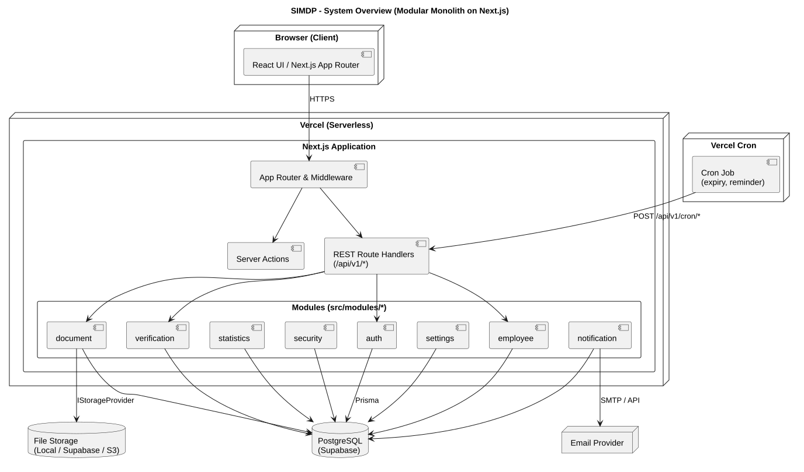
</p-->

* **Apa yang digambarkan?**: Perjalanan data saat pengguna membuka peramban (*browser*), meminta informasi ke server aplikasi Next.js, hingga data disimpan ke basis data PostgreSQL dan file storage.
* **Poin Penting yang Harus Diperhatikan**: Aplikasi memisahkan antara data teks (seperti NIP, nama, status) yang disimpan di Database PostgreSQL dengan data berkas fisik (PDF/JPG) yang disimpan di File Storage terpisah (Supabase/S3).
* **Mengapa Diagram Ini Penting?**: Memberikan kepastian bahwa aplikasi dibangun dengan arsitektur modern yang aman, terstruktur, dan tidak membebani server database utama saat pengunggahan berkas besar.

#### 2. Batas Aturan Import Antar Modul (`overview/module-boundary.svg`)

<p align="center"-->
  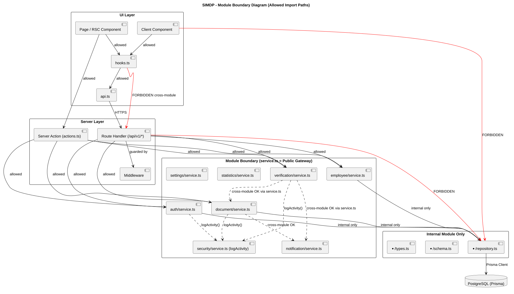
</p-->

* **Apa yang digambarkan?**: Aturan tegas mengenai modul mana yang boleh memanggil modul lain di dalam aplikasi.
* **Poin Penting yang Harus Diperhatikan**: Modul *Auth* (Keamanan) dan Modul *Employee* (Pegawai) adalah modul inti. Modul lain tidak boleh mengubah data di modul inti ini secara sembarangan, melainkan harus melalui gerbang resmi (*Service Boundary*).
* **Mengapa Diagram Ini Penting?**: Mencegah terjadinya bentrokan kode (*circular dependency*) sehingga aplikasi tetap mudah dikembangkan dan tidak rentan rusak saat ada pembaruan fitur.

#### 3. Topologi Server & Infrastruktur Deployment (`overview/deployment-overview.svg`)

<p align="center"-->
  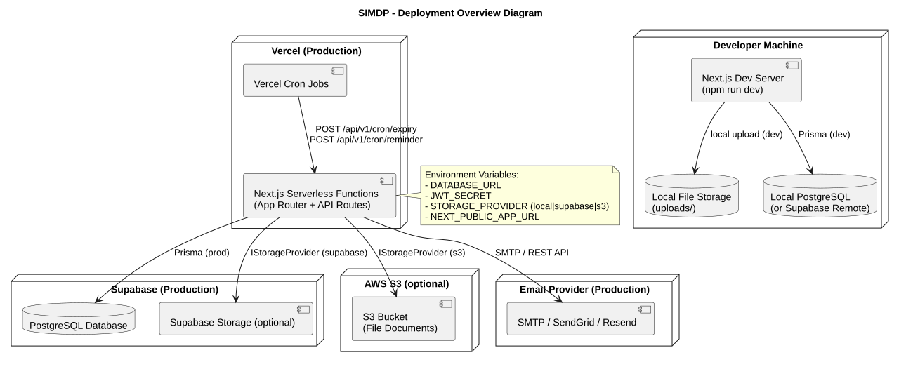
</p-->

* **Apa yang digambarkan?**: Lingkungan komputer server di mana SIMDP berjalan di dunia nyata.
* **Poin Penting yang Harus Diperhatikan**: Aplikasi di-host di layanan awan Vercel, database di Supabase Cloud, berkas fisik disimpan di S3, dan email notifikasi dikirimkan melalui penyedia layanan email khusus (Resend/SMTP).
* **Mengapa Diagram Ini Penting?**: Membantu tim IT rumah sakit memahami kebutuhan infrastruktur dan memastikan aplikasi aman serta dapat diakses 24 jam sehari.

---

### 4.2 Use Case Diagrams (Peta Peran Pengguna)

Use Case Diagram menjelaskan **siapa saja pengguna sistem dan hak akses apa yang mereka miliki**.

#### 1. Ringkasan Seluruh Peran Pengguna (`use-case/use-case-overview.svg`)

<p align="center"-->
  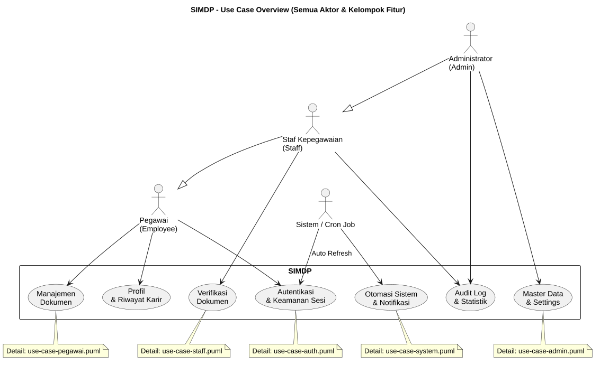
</p-->

* **Apa yang digambarkan?**: Peta helikopter yang menghubungkan seluruh aktor (Pegawai, Staf, Admin, Sistem) dengan kelompok fitur utama SIMDP.
* **Poin Penting yang Harus Diperhatikan**: Semua pengguna harus melalui gerbang autentikasi (Login) sebelum dapat menggunakan fitur sesuai dengan wewenang masing-masing.
* **Mengapa Diagram Ini Penting?**: Menjadi acuan dasar hak akses untuk menjamin kerahasiaan data kepegawaian.

#### 2. Peta Fitur Utama Sistem (`use-case/use-case.svg`)

<p align="center"-->
  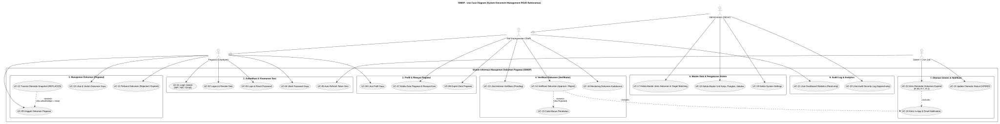
</p-->

* **Apa yang digambarkan?**: Rincian lengkap seluruh kegiatan yang dapat dilakukan oleh tiap aktor.
* **Poin Penting yang Harus Diperhatikan**: Adanya garis hierarki (`--|-->`) yang menunjukkan bahwa Staf Kepegawaian memiliki semua kemampuan Pegawai biasa, dan Admin memiliki wewenang tertinggi untuk mengelola seluruh aspek sistem.
* **Mengapa Diagram Ini Penting?**: Memastikan tidak ada tumpang tindih fungsi kerja antar pengguna di lingkungan RSUD Bahteramas.

#### 3. Fitur Autentikasi & Keamanan Sesi (`use-case/use-case-auth.svg`)

<p align="center"-->
  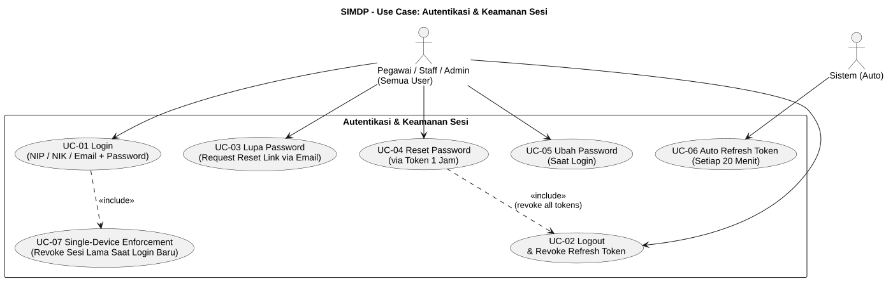
</p-->

* **Apa yang digambarkan?**: Fitur-fitur keamanan seperti Login (menggunakan NIP, NIK, atau Email), Logout, Ubah Password, Lupa Password, dan Perpanjangan Sesi Otomatis.
* **Poin Penting yang Harus Diperhatikan**: Pengguna diberikan kemudahan untuk login menggunakan identitas yang paling mereka ingat (NIP/NIK/Email).
* **Mengapa Diagram Ini Penting?**: Menjaga agar akun pegawai tetap aman dari akses pihak luar yang tidak berhak.

#### 4. Fitur Khusus Pegawai (`use-case/use-case-pegawai.svg`)

<p align="center"-->
  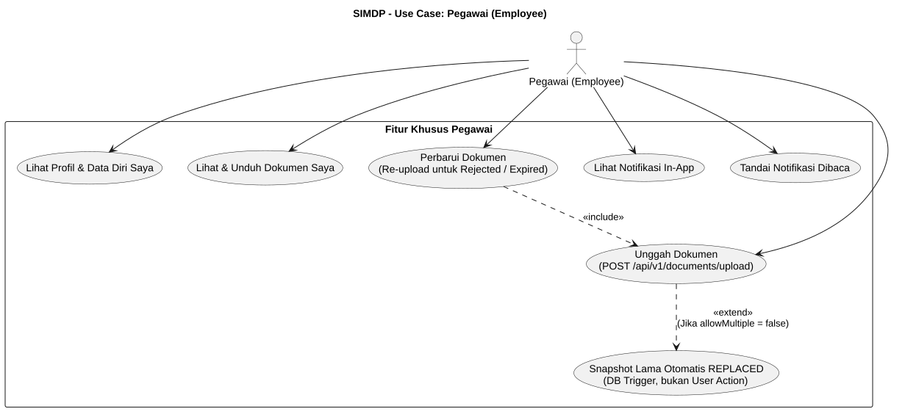
</p-->

* **Apa yang digambarkan?**: Layanan mandiri (*self-service*) untuk pegawai, seperti melihat profil diri, melihat riwayat karir, mengunggah dokumen baru, dan melihat status verifikasi berkas.
* **Poin Penting yang Harus Diperhatikan**: Pegawai dapat memantau secara langsung berkas mana yang sudah disetujui dan berkas mana yang ditolak tanpa harus bertanya langsung ke bagian kepegawaian.
* **Mengapa Diagram Ini Penting?**: Meningkatkan transparansi dan memotong rantai birokrasi pengurusan berkas kepegawaian.

#### 5. Fitur Staf Kepegawaian / Verifikator (`use-case/use-case-staff.svg`)

<p align="center"-->
  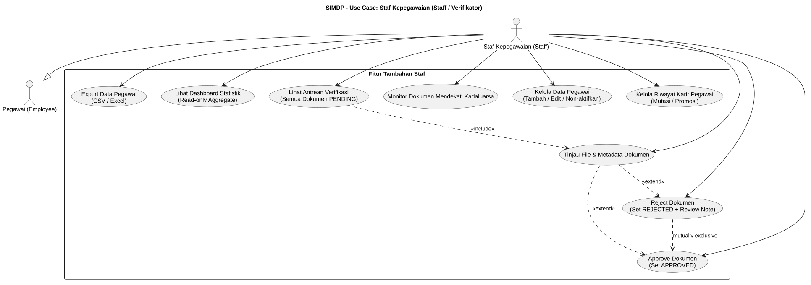
</p-->

* **Apa yang digambarkan?**: Fitur khusus untuk Staf Kepegawaian untuk meninjau antrean dokumen, menyetujui, menolak berkas, serta melihat riwayat verifikasi.
* **Poin Penting yang Harus Diperhatikan**: Staf wajib mengisi catatan/alasan jika menolak sebuah dokumen agar pegawai tahu apa yang harus diperbaiki.
* **Mengapa Diagram Ini Penting?**: Menjamin proses verifikasi dokumen berlangsung akurat, dapat dipertanggungjawabkan, dan terdokumentasi rapi.

#### 6. Fitur Eksklusif Administrator (`use-case/use-case-admin.svg`)

<p align="center"-->
  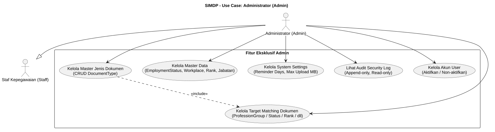
</p-->

* **Apa yang digambarkan?**: Hak akses khusus Admin untuk mengelola Data Master (seperti Tambah/Ubah/Hapus Jabatan, Unit Kerja, Jenis Dokumen), Pengaturan Sistem, dan Log Keamanan.
* **Poin Penting yang Harus Diperhatikan**: Fitur hapus data master menggunakan metode *soft delete* (data tidak langsung hilang permanen dari database melainkan dinonaktifkan) demi keamanan audit data.
* **Mengapa Diagram Ini Penting?**: Menjaga konsistensi data acuan yang digunakan oleh seluruh aplikasi.

#### 7. Otomasi Tugas Sistem (`use-case/use-case-system.svg`)

<p align="center"-->
  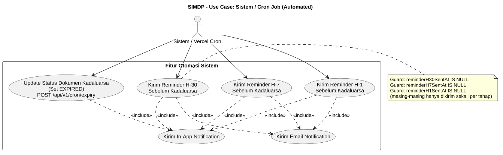
</p-->

* **Apa yang digambarkan?**: Kegiatan otomatis yang dijalankan oleh server tanpa perlu diklik oleh manusia, seperti pemantauan dokumen kadaluarsa dan pembersihan kunci sesi yang kadaluarsa.
* **Poin Penting yang Harus Diperhatikan**: Otomasi ini berjalan secara berkala (misal: setiap jam 00:00 malam) untuk mengecek dokumen yang mendekati tanggal kadaluarsa.
* **Mengapa Diagram Ini Penting?**: Menghilangkan risiko kelalaian manusia dalam memantau ribuan dokumen pegawai.

---

### 4.3 Activity Diagrams (Alur Langkah Kerja)

Activity Diagram menggambarkan **tahapan alur kerja bisnis dari titik awal hingga selesai**, mirip seperti bagan alur (*flowchart*).

#### 1. Alur Login & Pengelolaan Sesi (`activity/activity-login-session.svg`)

<p align="center"-->
  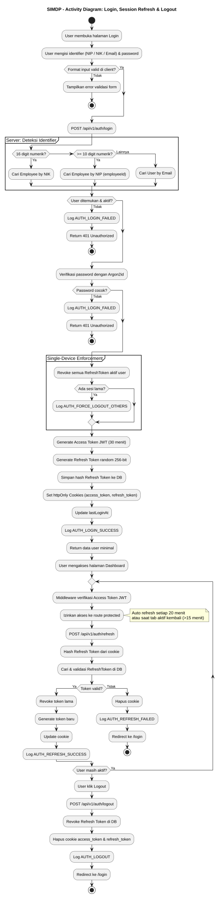
</p-->

* **Apa yang digambarkan?**: Langkah-langkah mulai saat pengguna mengetikkan nama pengguna/password, validasi keamanan, pembuatan token akses, perpanjangan sesi otomatis, hingga proses keluar (*logout*).
* **Poin Penting yang Harus Diperhatikan**: Jika pengguna tidak aktif dalam jangka waktu tertentu, sistem akan mencoba memperbarui sesi secara otomatis di latar belakang tanpa mengganggu pekerjaan pengguna.
* **Mengapa Diagram Ini Penting?**: Memastikan pengalaman pengguna (*user experience*) tetap nyaman namun keamanan akun terjaga.

#### 2. Alur Pengunggahan Dokumen Pegawai (`activity/activity-upload-document.svg`)

<p align="center"-->
  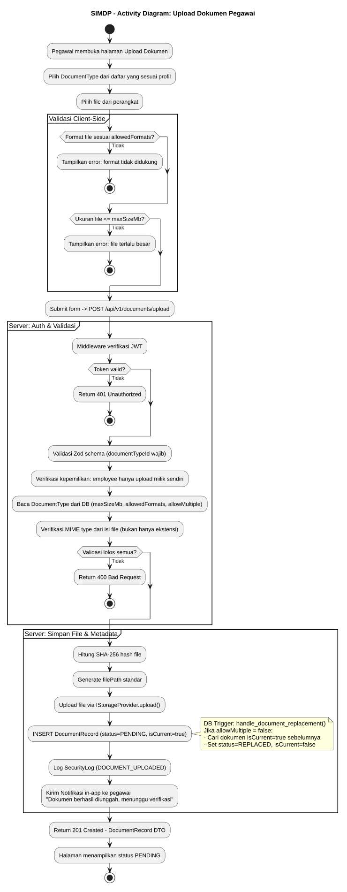
</p-->

* **Apa yang digambarkan?**: Urutan proses ketika Pegawai memilih file, mengisi informasi dokumen (nomor dokumen, tanggal terbit, tanggal kadaluarsa), validasi ukuran/format file, hingga berkas tersimpan.
* **Poin Penting yang Harus Diperhatikan**: Jika pegawai mengunggah dokumen baru untuk jenis dokumen yang sama (misal: STR baru), sistem otomatis menandai dokumen lama sebagai *REPLACED* (tergantikan).
* **Mengapa Diagram Ini Penting?**: Mencegah penumpukan dokumen ganda dan memastikan dokumen terbaru yang selalu menjadi acuan utama.

#### 3. Alur Verifikasi Dokumen oleh Staf (`activity/activity-verification-document.svg`)

<p align="center"-->
  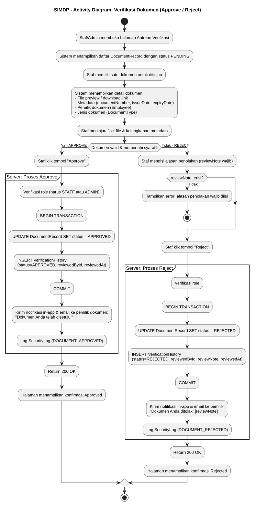
</p-->

* **Apa yang digambarkan?**: Langkah pemeriksaan dokumen oleh Staf Kepegawaian, mulai dari membuka antrean *PENDING*, memeriksa kesesuaian berkas fisik digital, hingga memberikan status *APPROVED* atau *REJECTED*.
* **Poin Penting yang Harus Diperhatikan**: Keputusan penolakan mewajibkan Staf memasukkan alasan penolakan yang nantinya dikirimkan otomatis ke email dan notifikasi pegawai.
* **Mengapa Diagram Ini Penting?**: Menjadi panduan operasional standar (*SOP*) bagi tim kepegawaian dalam memverifikasi berkas.

#### 4. Gambaran Umum Alur Dokumen (`activity/activity-document-workflow.svg`)

<p align="center"-->
  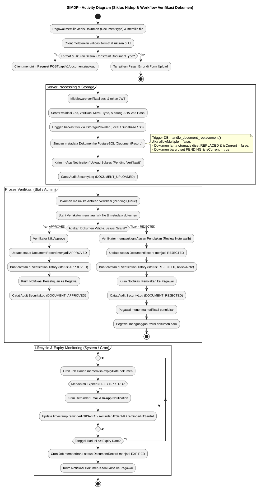
</p-->

* **Apa yang digambarkan?**: Peta menyeluruh perjalanan dokumen dari tahap pengunggahan, verifikasi, masa berlaku aktif, hingga kadaluarsa.
* **Poin Penting yang Harus Diperhatikan**: Memperlihatkan keterkaitan antara aksi pegawai, aksi verifikator, dan tindakan otomatis sistem.
* **Mengapa Diagram Ini Penting?**: Memberikan pemahaman utuh siklus hidup dokumen dalam satu gambar ringkas.

#### 5. Ringkasan Pengelolaan Data Master (`activity/activity-master-data.svg`)

<p align="center"-->
  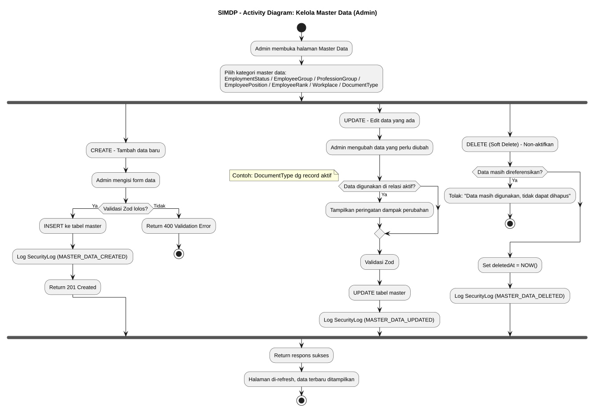
</p-->

* **Apa yang digambarkan?**: Ringkasan alur tambah, ubah, dan nonaktifkan data acuan sistem (seperti Jabatan, Pangkat, Unit Kerja).
* **Poin Penting yang Harus Diperhatikan**: Menunjukkan proses pengecekan duplikasi kode master sebelum data baru disimpan.
* **Mengapa Diagram Ini Penting?**: Memastikan tidak ada kode master ganda yang dapat membingungkan pelaporan data pegawai.

#### 6. Alur Lengkap Pengelolaan Master Data Admin (`activity/activity-master-data-admin.svg`)

<p align="center"-->
  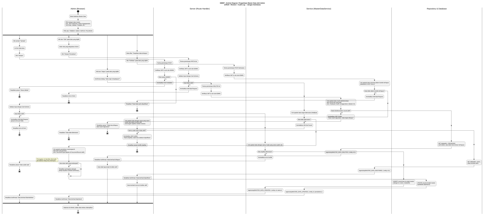
</p-->

* **Apa yang digambarkan?**: Detail alur *CRUD* (Create, Read, Update, Delete) master data yang melintasi 4 jalur wewenang (*swimlane*): Admin, Server Aplikasi, Service Layer, dan Database.
* **Poin Penting yang Harus Diperhatikan**: Apabila Admin hendak menghapus sebuah Jabatan, sistem akan memvalidasi terlebih dahulu apakah masih ada pegawai yang terhubung ke jabatan tersebut. Jika masih ada, penghapusan ditolak demi menjaga keutuhan data.
* **Mengapa Diagram Ini Penting?**: Menjaga integritas referensi data (*referential integrity*) di seluruh database SIMDP.

#### 7. Alur Otomasi Pengingat Kadaluarsa Dokumen (`activity/activity-reminder-expiry.svg`)

<p align="center"-->
  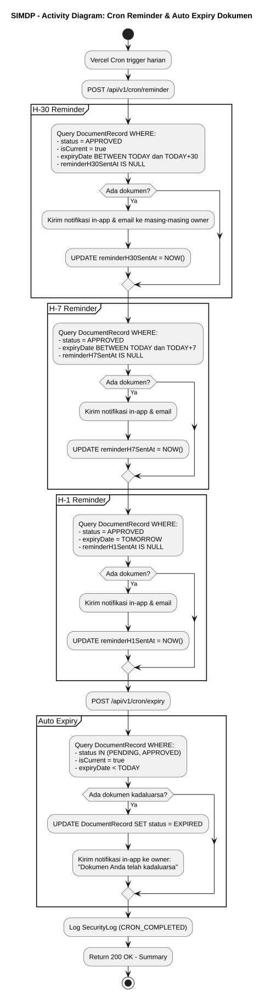
</p-->

* **Apa yang digambarkan?**: Proses harian sistem otomatis dalam memeriksa tanggal kadaluarsa dokumen, mengirimkan notifikasi H-30, H-7, H-1, dan mengubah status menjadi *EXPIRED* saat tanggal kadaluarsa tiba.
* **Poin Penting yang Harus Diperhatikan**: Notifikasi dikirimkan melalui 2 saluran sekaligus: pesan di dalam aplikasi (*in-app*) dan surat elektronik (*email*).
* **Mengapa Diagram Ini Penting?**: Memastikan pegawai dan manajemen rumah sakit mendapatkan peringatan dini sebelum dokumen penting kehilangan legalitasnya.

---

### 4.4 Sequence Diagrams (Interaksi Detail di Balik Layar)

Sequence Diagram memperlihatkan **urutan jalannya pesan dan pertukaran data antar komponen teknis** secara rinci dari atas ke bawah.

#### 1. Urutan Proses Autentikasi Pengguna (`sequence/sequence-auth.svg`)

<p align="center"-->
  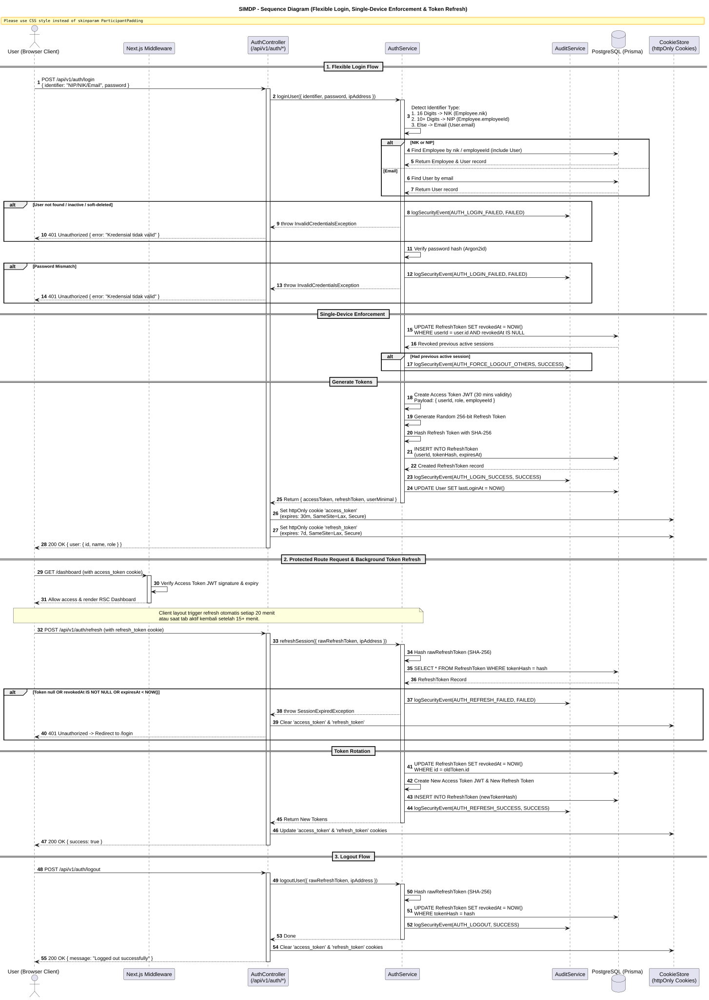
</p-->

* **Apa yang digambarkan?**: Bagaimana komponen antarmuka (*UI*), pengawal sesi (*Auth Guard*), pemroses logika (*Service*), dan database bekerja sama saat proses login dilakukan.
* **Poin Penting yang Harus Diperhatikan**: Password pegawai disimpan dalam bentuk acak aman (*hash*) dan tidak pernah disimpan dalam bentuk teks biasa.
* **Mengapa Diagram Ini Penting?**: Membuktikan bahwa standar keamanan tinggi diterapkan dalam perlindungan kata sandi pegawai.

#### 2. Urutan Login, Perpanjangan Token, & Logout (`sequence/sequence-login-refresh-logout.svg`)

<p align="center"-->
  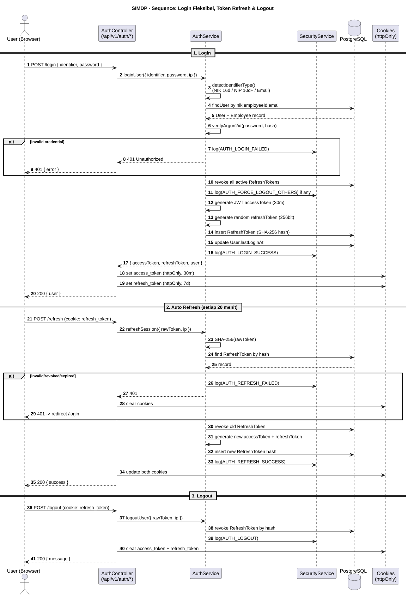
</p-->

* **Apa yang digambarkan?**: Alur pertukaran kunci rahasia (*Access Token & Refresh Token*) antara komputer pengguna dan server selama sesi pengguna berlangsung.
* **Poin Penting yang Harus Diperhatikan**: Penerapan mekanisme *token rotation* (kunci diperbarui setiap kali digunakan) untuk mencegah pembajakan sesi.
* **Mengapa Diagram Ini Penting?**: Melindungi sesi pengguna agar tidak bisa disalahgunakan oleh pihak yang tidak bertanggung jawab.

#### 3. Urutan Lupa & Reset Password (`sequence/sequence-forgot-reset-password.svg`)

<p align="center"-->
  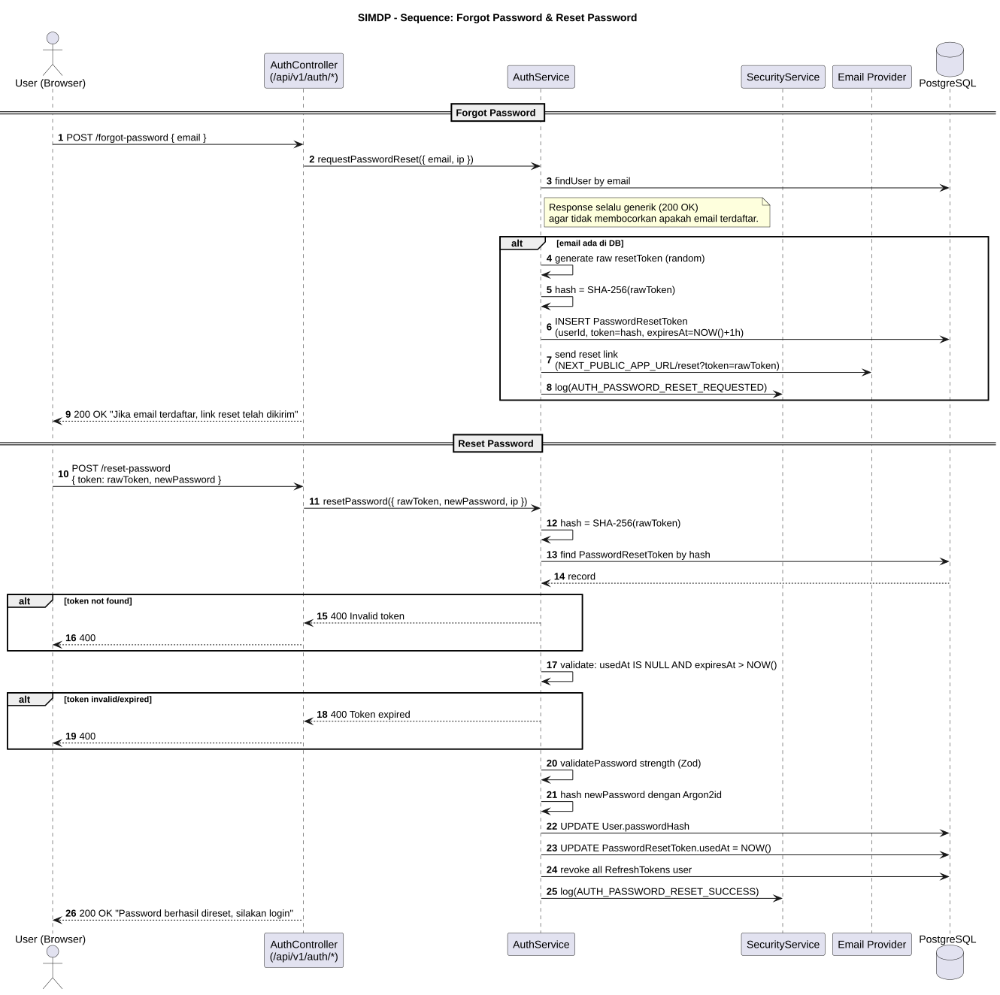
</p-->

* **Apa yang digambarkan?**: Langkah-langkah saat pegawai lupa password: meminta tautan reset $\rightarrow$ penerbitan token khusus $\rightarrow$ pengiriman email tautan aman $\rightarrow$ konfirmasi pembuatan password baru.
* **Poin Penting yang Harus Diperhatikan**: Tautan reset password memiliki batas waktu berlaku singkat (misal: 15 menit) dan hanya bisa digunakan 1 kali saja.
* **Mengapa Diagram Ini Penting?**: Memberikan cara mandiri yang aman bagi pegawai untuk memulihkan kata sandi tanpa harus mendatangi kantor tim IT.

#### 4. Urutan Pengunggahan Dokumen (`sequence/sequence-upload-document.svg`)

<p align="center"-->
  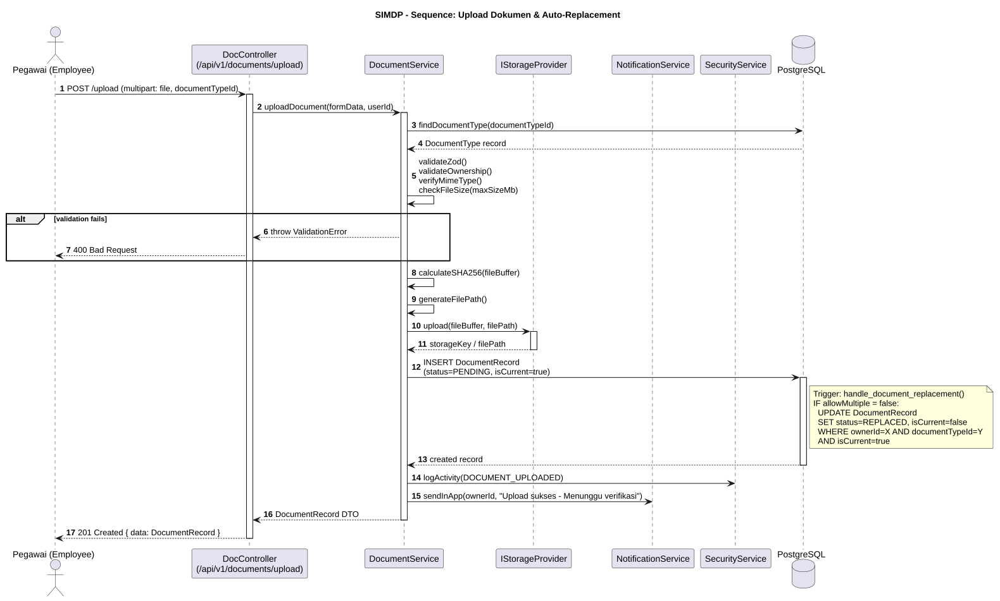
</p-->

* **Apa yang digambarkan?**: Interaksi teknis saat file diunggah: validasi Zod $\rightarrow$ pembuatan nama unik berkas $\rightarrow$ penyimpanan ke S3/Supabase Storage $\rightarrow$ pencatatan metadata ke PostgreSQL.
* **Poin Penting yang Harus Diperhatikan**: Jika terjadi kegagalan saat menyimpan catatan di database, file yang sudah terunggah di Storage akan otomatis dihapus kembali (*rollback*) agar tidak menjadi file sampah.
* **Mengapa Diagram Ini Penting?**: Menjamin konsistensi antara file yang tersimpan di storage fisik dengan data di database.

#### 5. Urutan Manajemen Dokumen (`sequence/sequence-document.svg`)

<p align="center"-->
  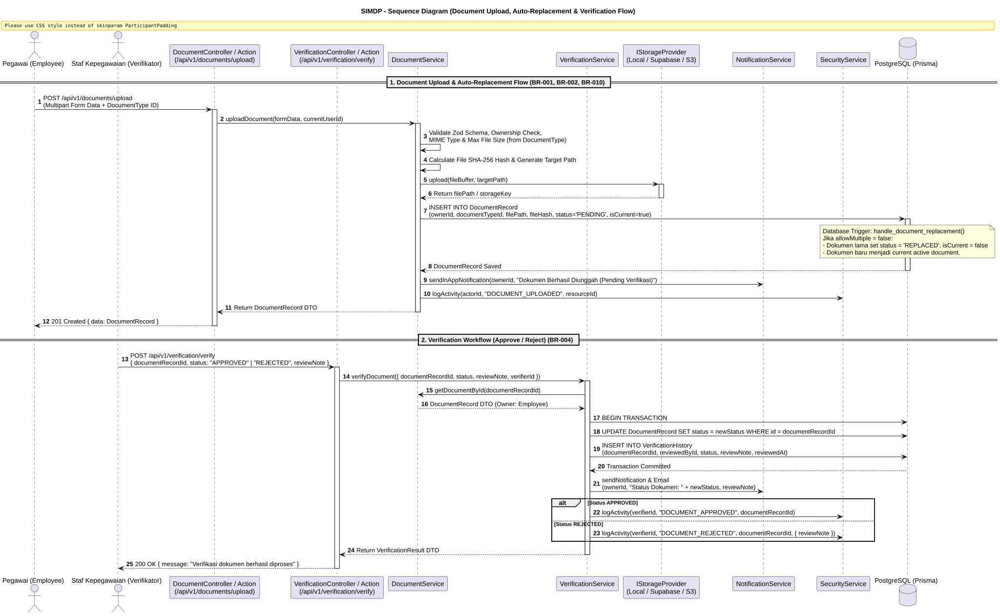
</p-->

* **Apa yang digambarkan?**: Pertukaran pesan dalam pengelolaan siklus dokumen mencakup pengunggahan, pembaruan informasi, dan penghapusan logis (*soft delete*).
* **Poin Penting yang Harus Diperhatikan**: Dokumen yang dihapus pegawai tidak langsung hilang permanen, melainkan diberi tanda dihapus (*deletedAt*) sehingga masih dapat dipulihkan jika terjadi kesalahan.
* **Mengapa Diagram Ini Penting?**: Menjaga jejak rekam data arsip agar tidak mudah hilang akibat ketidaksengajaan.

#### 6. Urutan Verifikasi Dokumen (`sequence/sequence-verification-document.svg`)

<p align="center"-->
  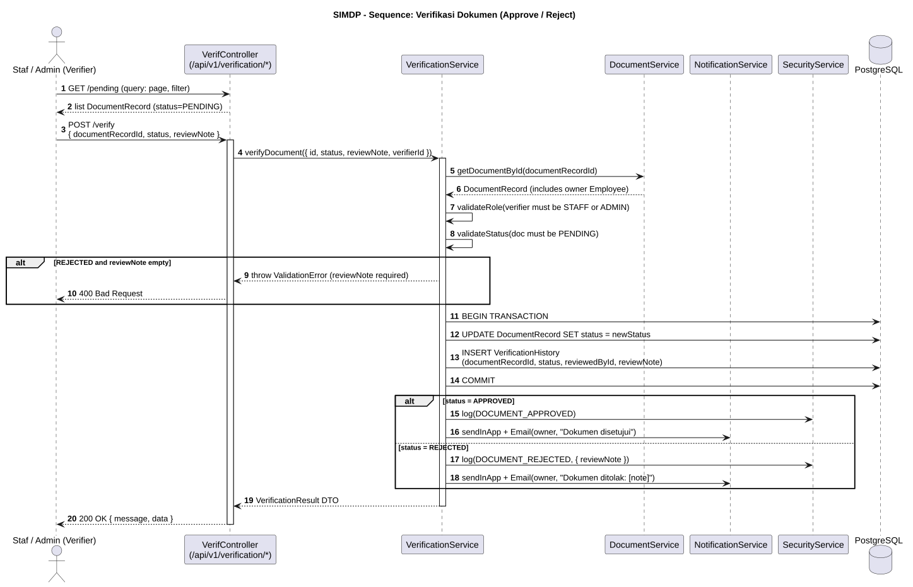
</p-->

* **Apa yang digambarkan?**: Alur komunikasi saat Staf menyetujui/menolak berkas, pembaruan status di database, pembuatan riwayat verifikasi (*Audit Log*), dan pemicuan notifikasi.
* **Poin Penting yang Harus Diperhatikan**: Setiap aksi verifikasi mencatat NIP Staf peninjau, tanggal jam pasti, dan catatan peninjauan secara permanen.
* **Mengapa Diagram Ini Penting?**: Menyediakan bukti audit yang sah jika sewaktu-waktu terjadi sengketa berkas kepegawaian.

#### 7. Urutan Verifikasi Publik Dokumen (`sequence/sequence-public-verification.svg`)

<p align="center"-->
  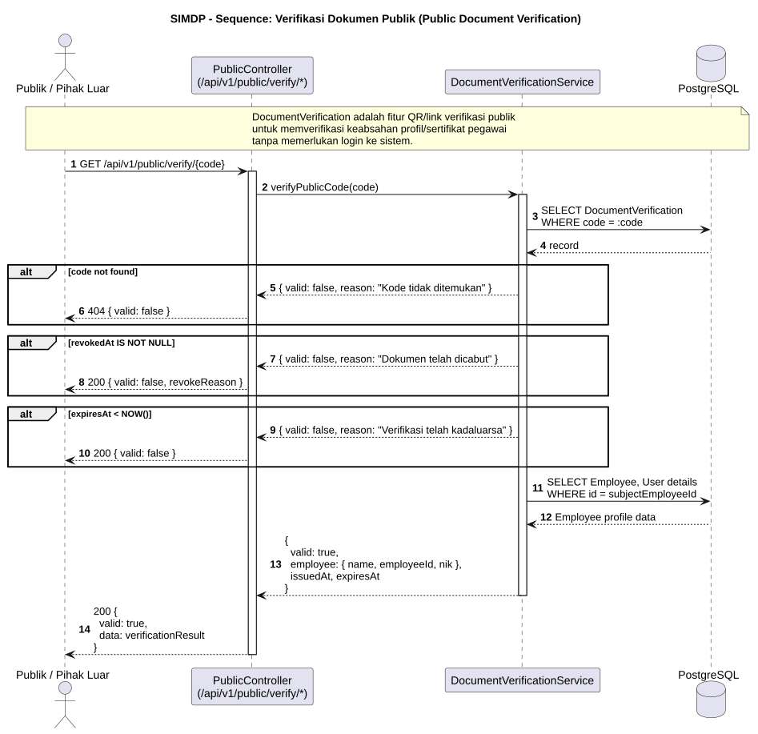
</p-->

* **Apa yang digambarkan?**: Proses ketika pihak luar (misal: instansi lain) memindai QR Code pada dokumen SIMDP untuk mengecek apakah dokumen tersebut asli atau palsu.
* **Poin Penting yang Harus Diperhatikan**: Verifikasi publik tidak memerlukan login, namun hanya menampilkan informasi keabsahan dokumen tanpa membocorkan data pribadi sensitif pegawai.
* **Mengapa Diagram Ini Penting?**: Meningkatkan kepercayaan publik dan mempermudah pembuktian keabsahan dokumen resmi RSUD Bahteramas.

#### 8. Urutan Pengiriman Notifikasi System (`sequence/sequence-notification-dispatch.svg`)

<p align="center"-->
  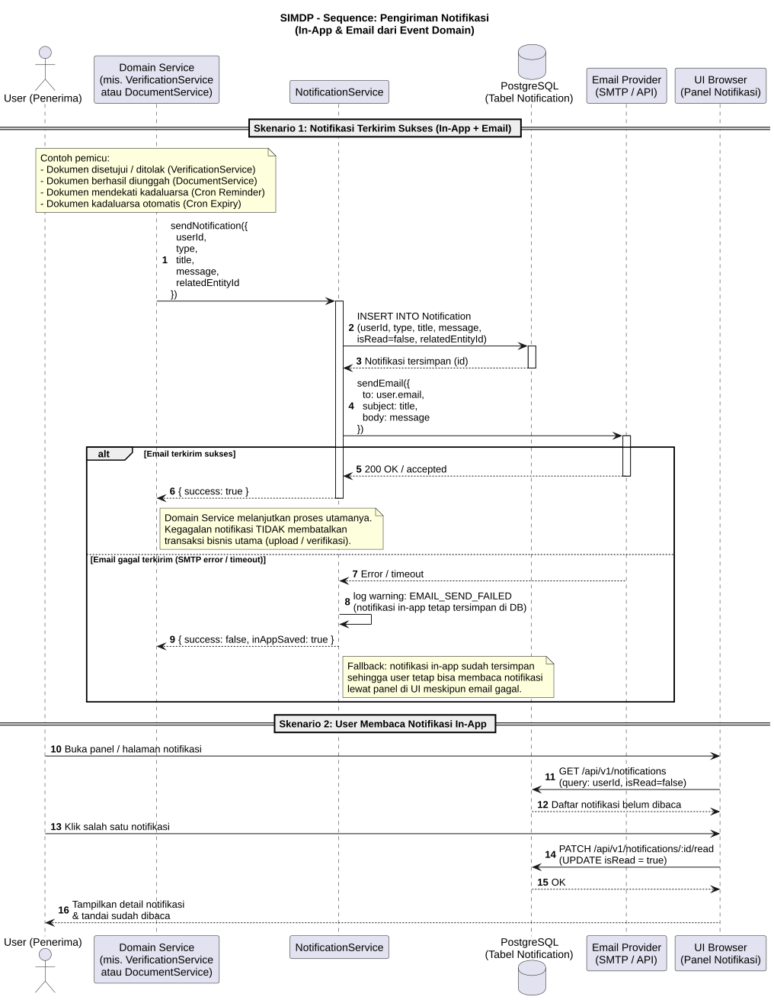
</p-->

* **Apa yang digambarkan?**: Bagaimana sistem menerima pemicu (*event*) notifikasi, menyimpan pesan ke dalam kotak masuk aplikasi, dan mengirimkan email secara paralel.
* **Poin Penting yang Harus Diperhatikan**: Jika pengiriman email gagal (misal: koneksi internet terganggu), pesan tetap tersimpan aman di kotak masuk aplikasi (*in-app notification*).
* **Mengapa Diagram Ini Penting?**: Memastikan informasi penting mengenai status dokumen selalu sampai ke tangan pegawai.

#### 9. Urutan Manajemen Master Data Admin (`sequence/sequence-master-data-admin.svg`)

<p align="center"-->
  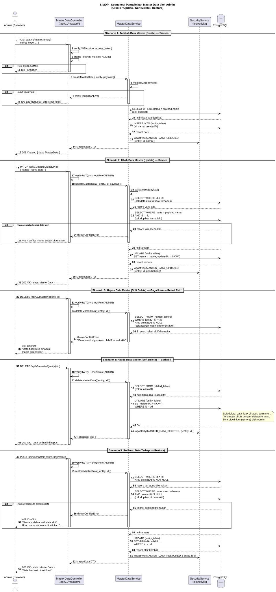
</p-->

* **Apa yang digambarkan?**: Komunikasi teknis detail saat Admin menambah, mengubah, menonaktifkan, atau memulihkan data acuan master data.
* **Poin Penting yang Harus Diperhatikan**: Pengecekan otorisasi peran (*Admin Check*) dilakukan secara ketat di setiap awal permintaan.
* **Mengapa Diagram Ini Penting?**: Memastikan keamanan tingkat tinggi pada fungsi-fungsi vital pengubah konfigurasi aplikasi.

---

### 4.5 State Diagrams (Siklus Perubahan Status)

State Diagram menggambarkan **perubahan kondisi status suatu objek data dari waktu ke waktu** akibat adanya pemicu atau kejadian (*event*).

#### 1. Perubahan Status Dokumen Pegawai (`state/state-document-record.svg`)

<p align="center"-->
  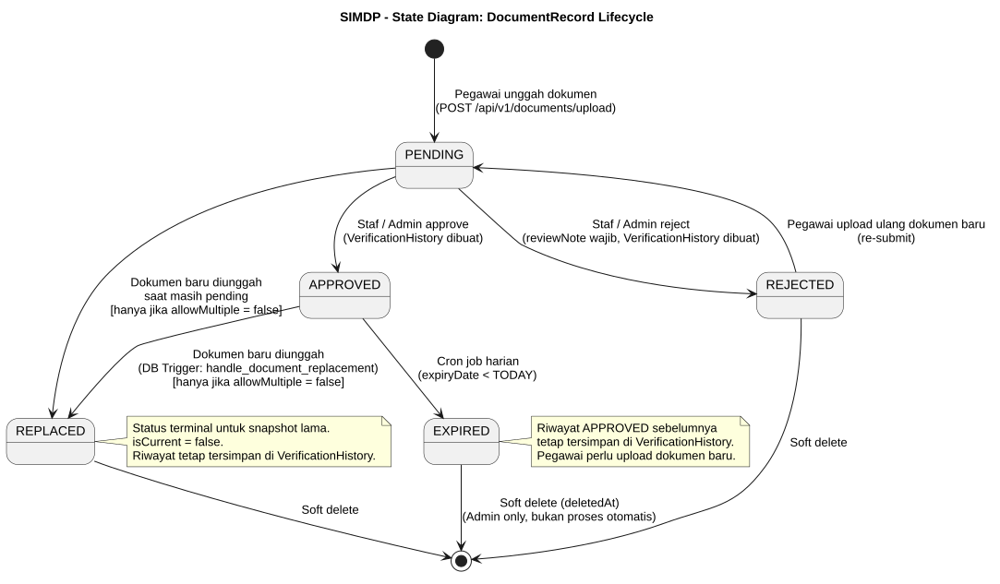
</p-->

* **Apa yang digambarkan?**: Perjalanan status satu berkas dokumen dari pertama diunggah hingga akhir masa berlakunya.
* **Poin Penting yang Harus Diperhatikan**:
  -  **PENDING**: Dokumen baru diunggah, menunggu ditinjau Staf.
  -  **APPROVED**: Dokumen disetujui Staf dan dinyatakan sah berlaku.
  -  **REJECTED**: Dokumen ditolak Staf (pegawai harus upload ulang).
  -  **EXPIRED**: Masa berlaku dokumen telah habis dipicu oleh sistem otomatis.
  -  **REPLACED**: Dokumen lama digantikan oleh unggahan versi terbaru.
* **Mengapa Diagram Ini Penting?**: Menjadi acuan status utama dalam seluruh laporan kepegawaian.

#### 2. Perubahan Status Kode Verifikasi Publik (`state/state-document-verification.svg`)

<p align="center"-->
  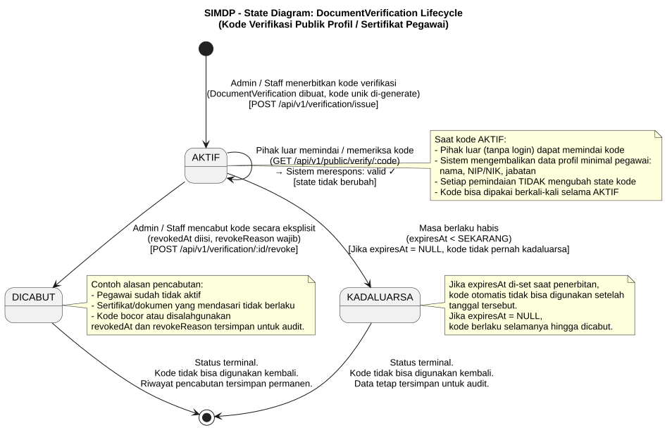
</p-->

* **Apa yang digambarkan?**: Siklus status kode unik/QR Code verifikasi publik: **AKTIF** $\rightarrow$ **DICABUT** (jika dokumen dibatalkan) atau **KADALUARSA**.
* **Poin Penting yang Harus Diperhatikan**: Kode verifikasi publik akan otomatis menjadi tidak valid jika dokumen aslinya telah diganti atau kadaluarsa.
* **Mengapa Diagram Ini Penting?**: Mencegah penyalahgunaan QR Code dari dokumen-dokumen lama yang sudah tidak berlaku.

#### 3. Perubahan Status Kunci Sesi Refresh Token (`state/state-refresh-token.svg`)

<p align="center"-->
  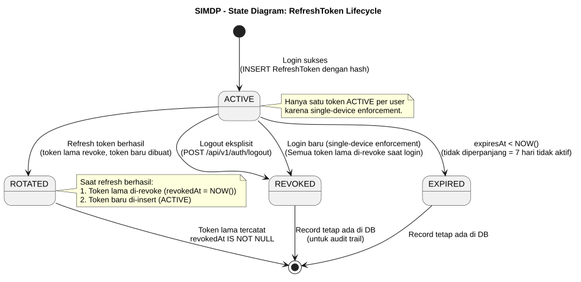
</p-->

* **Apa yang digambarkan?**: Siklus hidup kunci sesi pengguna: **ACTIVE** $\rightarrow$ **ROTATED** (diperbarui) $\rightarrow$ **REVOKED** (dicabut saat logout) $\rightarrow$ **EXPIRED** (kadaluarsa otomatis).
* **Poin Penting yang Harus Diperhatikan**: Kunci yang sudah dicabut tidak dapat digunakan kembali untuk masuk ke sistem.
* **Mengapa Diagram Ini Penting?**: Menjamin keamanan sesi pengguna di peramban web.

#### 4. Perubahan Status Token Reset Password (`state/state-password-reset-token.svg`)

<p align="center"-->
  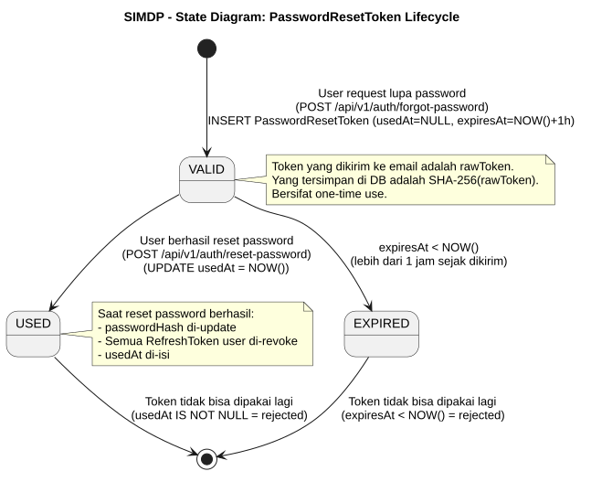
</p-->

* **Apa yang digambarkan?**: Siklus token pemulihan kata sandi: **VALID** $\rightarrow$ **USED** (sudah dipakai) atau **EXPIRED** (habis waktu).
* **Poin Penting yang Harus Diperhatikan**: Token hanya berlaku untuk satu kali penggunaan demi keamanan.
* **Mengapa Diagram Ini Penting?**: Mencegah peretasan akun melalui tautan pemulihan password lama.

#### 5. Perubahan Status Notifikasi Pengguna (`state/state-notification.svg`)

<p align="center"-->
  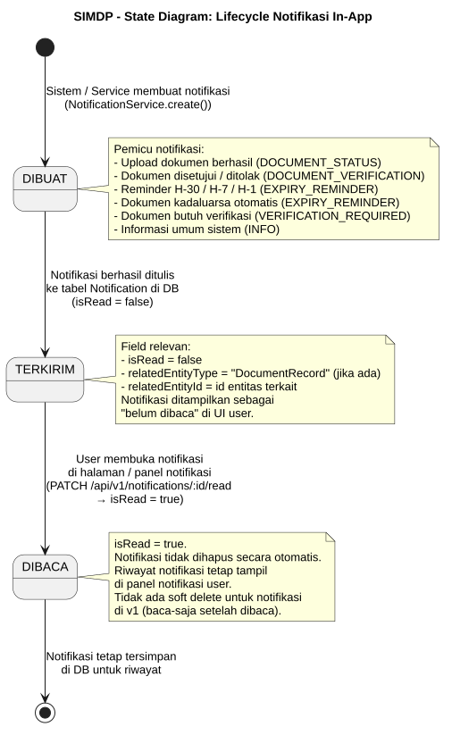
</p-->

* **Apa yang digambarkan?**: Perubahan kondisi pesan notifikasi: **DIBUAT** $\rightarrow$ **TERKIRIM** $\rightarrow$ **DIBACA** (saat pengguna mengklik pesan).
* **Poin Penting yang Harus Diperhatikan**: Sistem mencatat jumlah notifikasi yang belum dibaca (*unread count*) untuk ditampilkan pada ikon lonceng di aplikasi.
* **Mengapa Diagram Ini Penting?**: Membantu pengguna membedakan informasi mana yang sudah dibaca dan mana yang memerlukan perhatian segera.

---

### 4.6 Class Diagrams (Struktur Data & Entitas Domain)

Class Diagram menggambarkan **model data, atribut, dan hubungan antar objek** yang menyusun sistem SIMDP.

#### 1. Gambaran Umum Seluruh Domain Data (`class/class-domain-overview.svg`)

<p align="center"-->
  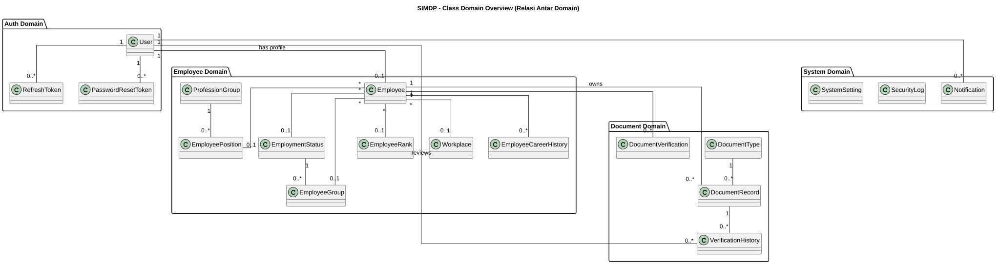
</p-->

* **Apa yang digambarkan?**: Peta hubungan tingkat tinggi antar 4 domain utama: *Auth Domain*, *Employee Domain*, *Document Domain*, dan *System/Security Domain*.
* **Poin Penting yang Harus Diperhatikan**: Bagaimana satu entitas Pegawai (*Employee*) menjadi pusat yang menghubungkan akun pengguna (*User*), dokumen (*DocumentRecord*), dan riwayat jabatan.
* **Mengapa Diagram Ini Penting?**: Menjadi panduan konseptual utama pengembangan model bisnis SIMDP.

#### 2. Rincian Cetak Biru Struktur Data SIMDP (`class/class-domain.svg`)

<p align="center"-->
  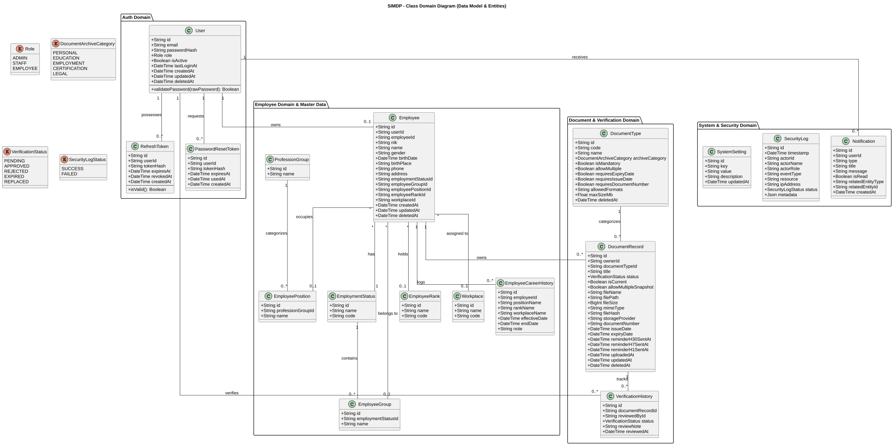
</p-->

* **Apa yang digambarkan?**: Gambar teknik detail seluruh kelas data, tipe data atribut, fungsi internal, serta relasi spesifiknya (seperti 1-ke-banyak atau 1-ke-1).
* **Poin Penting yang Harus Diperhatikan**: Setiap entitas dilengkapi atribut pencatatan waktu otomatis (`createdAt`, `updatedAt`, `deletedAt`).
* **Mengapa Diagram Ini Penting?**: Menjadi acuan langsung bagi pengembang kode program (*software engineer*) dalam membuat tipe data TypeScript dan model Prisma ORM.

#### 3. Struktur Data Keamanan & Akun (`class/class-auth-domain.svg`)

<p align="center"-->
  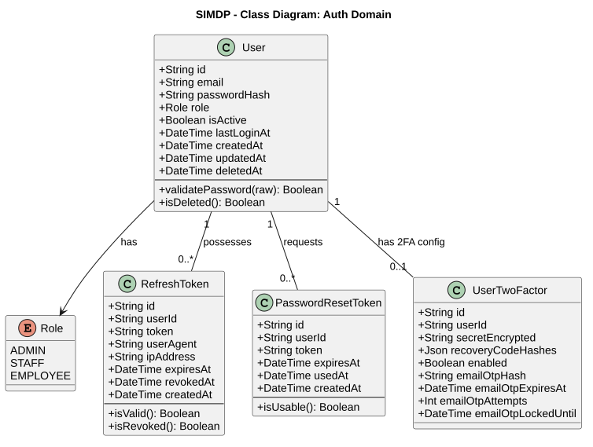
</p-->

* **Apa yang digambarkan?**: Entitas pengelola akun pengguna mencakup `User`, `RefreshToken`, `PasswordResetToken`, dan aturan peran `Role` (ADMIN, STAFF, EMPLOYEE).
* **Poin Penting yang Harus Diperhatikan**: Pemisahan tegas antara data akun login (`User`) dengan data profil fisik pegawai (`Employee`).
* **Mengapa Diagram Ini Penting?**: Fleksibilitas sistem jika di masa depan ada akun pengguna yang bukan merupakan pegawai tetap (seperti akun tamu/magang).

#### 4. Struktur Data Pegawai & Master Data (`class/class-employee-domain.svg`)

<p align="center"-->
  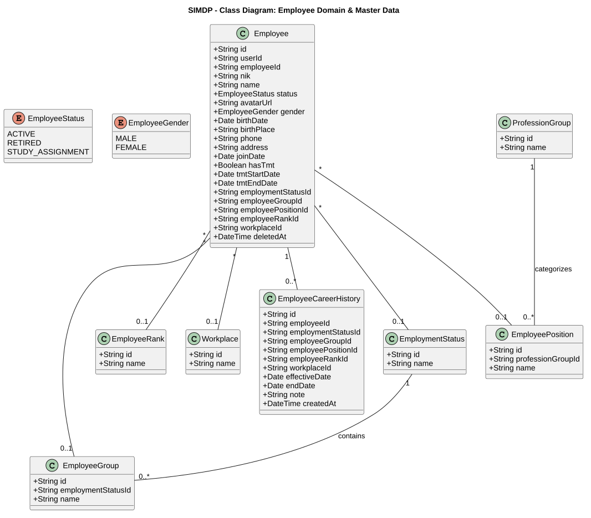
</p-->

* **Apa yang digambarkan?**: Entitas `Employee` beserta seluruh master data pendukungnya: `EmploymentStatus` (Status Kerja), `EmployeeGroup` (Kelompok), `ProfessionGroup` (Profesi), `EmployeePosition` (Jabatan), `EmployeeRank` (Pangkat/Golongan), `Workplace` (Unit Kerja), dan `EmployeeCareerHistory` (Riwayat Karir).
* **Poin Penting yang Harus Diperhatikan**: Riwayat karir menyimpan rekam jejak perubahan jabatan dan tempat kerja pegawai dari waktu ke waktu.
* **Mengapa Diagram Ini Penting?**: Mendukung pengelolaan data kepegawaian RSUD Bahteramas yang kompleks dan dinamis.

#### 5. Struktur Data Dokumen & Verifikasi (`class/class-document-domain.svg`)

<p align="center"-->
  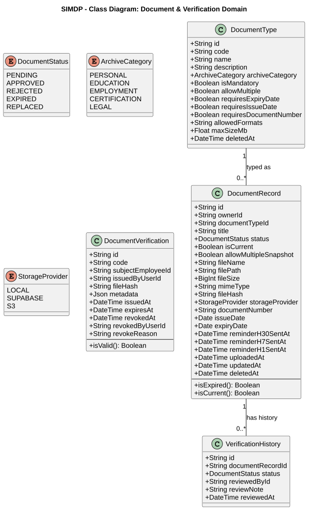
</p-->

* **Apa yang digambarkan?**: Entitas `DocumentType` (Kualifikasi jenis berkas), `DocumentRecord` (Berkas unggahan), `VerificationHistory` (Riwayat verifikasi), dan `DocumentVerification` (Kode QR publik).
* **Poin Penting yang Harus Diperhatikan**: `DocumentType` mengatur aturan main tiap dokumen, seperti apakah wajib, apakah butuh tanggal kadaluarsa, dan berapa ukuran maksimal file.
* **Mengapa Diagram Ini Penting?**: Memberikan fleksibilitas bagi Admin untuk menambah jenis dokumen baru di masa depan tanpa mengubah kode program.

#### 6. Struktur Data Notifikasi & Keamanan System (`class/class-notification-security-domain.svg`)

<p align="center"-->
  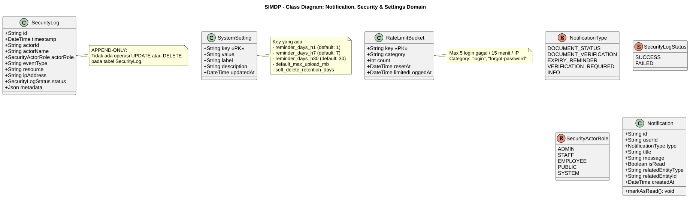
</p-->

* **Apa yang digambarkan?**: Entitas `Notification` (Pesan pemberitahuan), `SecurityLog` (Catatan aktivitas keamanan), `SystemSetting` (Pengaturan aplikasi), dan `RateLimitBucket` (Pencegah serangan siber).
* **Poin Penting yang Harus Diperhatikan**: `SecurityLog` mencatat IP address, browser, tanggal jam, dan aksi yang dilakukan untuk mendeteksi aktivitas mencurigakan.
* **Mengapa Diagram Ini Penting?**: Menjamin transparansi audit keamanan dan perlindungan dari ancaman siber.

---

### 4.7 Component Diagrams (Batas Komponen & Infrastruktur)

Component Diagram menggambarkan **komponen-komponen pembangun aplikasi dan bagaimana modul internal terhubung**.

#### 1. Arsitektur Komponen Modul Internal (`component/component-module.svg`)

<p align="center"-->
  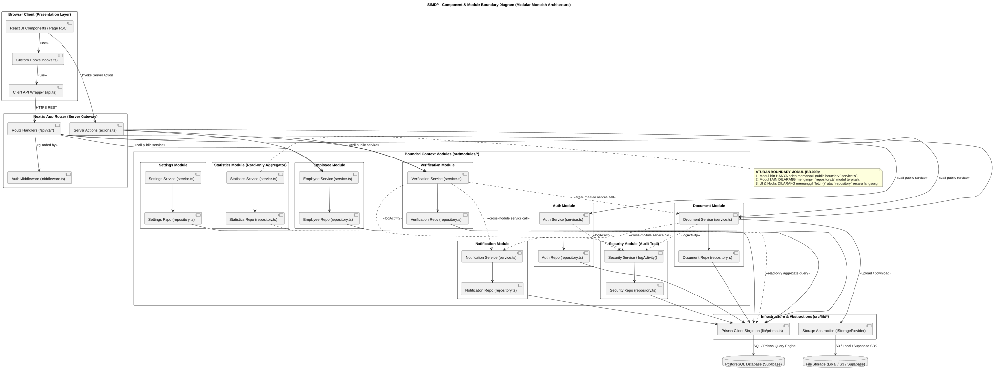
</p-->

* **Apa yang digambarkan?**: Struktur internal aplikasi SIMDP yang terbagi menjadi modul-modul mandiri (*modular monolith*).
* **Poin Penting yang Harus Diperhatikan**: Setiap modul memiliki komponen *Controller/Action*, *Service* (Logika Bisnis), dan *Repository* (Akses Database) sendiri.
* **Mengapa Diagram Ini Penting?**: Memudahkan pembagian tugas antar tim pengembang aplikasi.

#### 2. Batas & Aturan Komunikasi Komponen (`component/component-module-boundary.svg`)

<p align="center"-->
  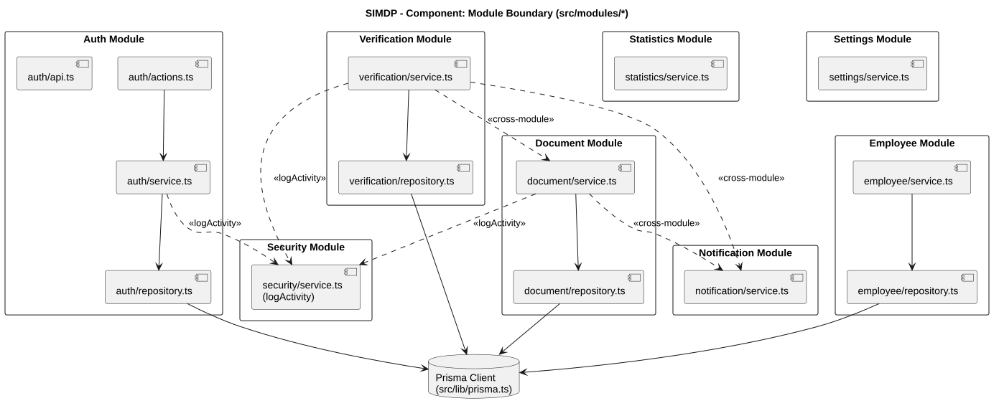
</p-->

* **Apa yang digambarkan?**: Aturan komunikasi antar komponen di mana modul satu hanya boleh memanggil fungsi resmi (*public API*) dari modul lainnya.
* **Poin Penting yang Harus Diperhatikan**: Dilarang keras melakukan manipulasi langsung ke database milik modul lain.
* **Mengapa Diagram Ini Penting?**: Menjaga kualitas kode (*clean code*) dan mencegah bug tersembunyi.

#### 3. Alur Data Antara Frontend & Backend (`component/component-frontend-backend-flow.svg`)

<p align="center"-->
  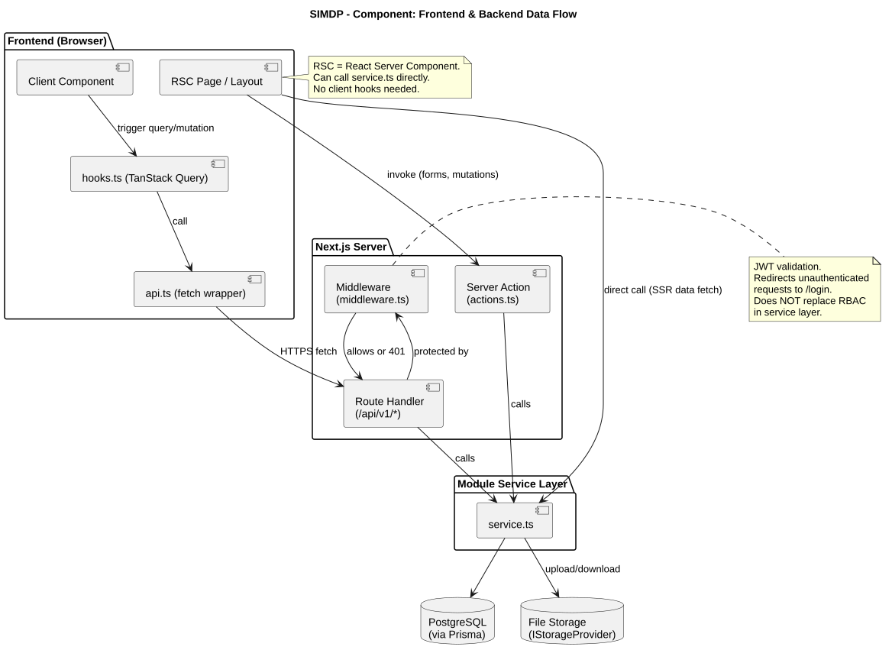
</p-->

* **Apa yang digambarkan?**: Perjalanan permintaan dari komponen antarmuka pengguna (*React Client Component*), melalui *Server Action / Route Handler*, diproses oleh *Service*, hingga kembali dalam bentuk tampilan visual.
* **Poin Penting yang Harus Diperhatikan**: Validasi keamanan dilakukan di dua tingkat: di layar peramban (untuk kenyamanan pengguna) dan di server (untuk keamanan data).
* **Mengapa Diagram Ini Penting?**: Menjamin aplikasi merespons interaksi pengguna dengan cepat dan aman.

#### 4. Arsitektur Penyimpanan Berkas Infrastructure (`component/component-storage-infrastructure.svg`)

<p align="center"-->
  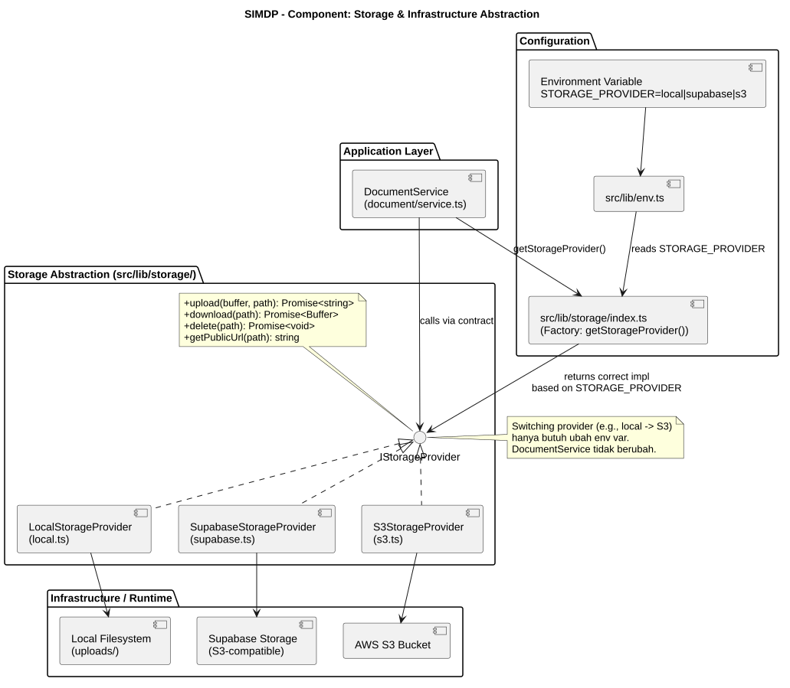
</p-->

* **Apa yang digambarkan?**: Komponen pengelola file storage (*Storage Provider*) yang fleksibel.
* **Poin Penting yang Harus Diperhatikan**: Aplikasi dapat dengan mudah berganti tempat penyimpanan (misal dari Penyimpanan Lokal Komputer ke Supabase Storage atau AWS S3) hanya dengan mengubah pengaturan tanpa perlu membongkar seluruh kode program.
* **Mengapa Diagram Ini Penting?**: Memberikan kemudahan adaptasi infrastruktur sesuai anggaran dan kebijakan IT RSUD Bahteramas.

---

### 4.8 ERD Diagrams (Struktur Tabel Database)

Entity Relationship Diagram (ERD) menggambarkan **rancangan fisik tabel-tabel di dalam database PostgreSQL**.

#### 1. Rancangan Basis Data Utama SIMDP (`erd/erd.svg`)

<p align="center"-->
  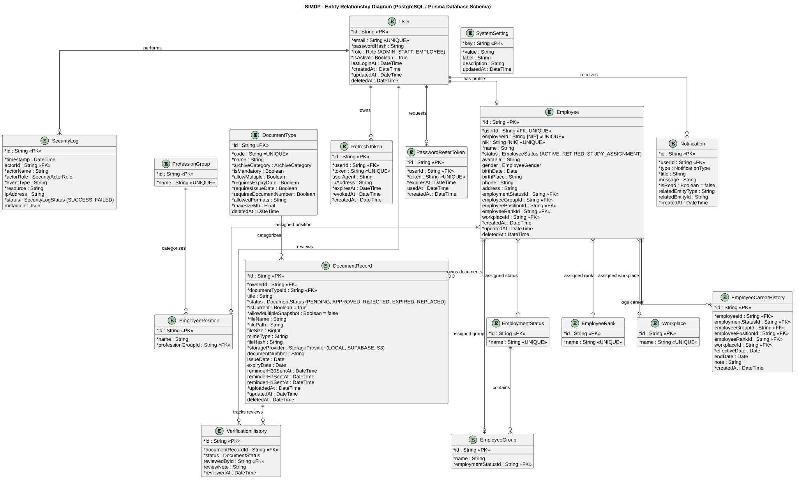
</p-->

* **Apa yang digambarkan?**: Peta lengkap seluruh tabel, kolom, tipe data, dan kunci relasi (*Primary Key & Foreign Key*) yang membentuk database SIMDP.
* **Poin Penting yang Harus Diperhatikan**: Hubungan antar tabel dijaga dengan aturan *foreign key constraint* untuk mencegah adanya data yatim (*orphan data*).
* **Mengapa Diagram Ini Penting?**: Landasan utama bagi pemeliharaan dan pengoptimalan performa database PostgreSQL.

#### 2. Tabel Database Modul Keamanan & Akun (`erd/erd-auth.svg`)

<p align="center"-->
  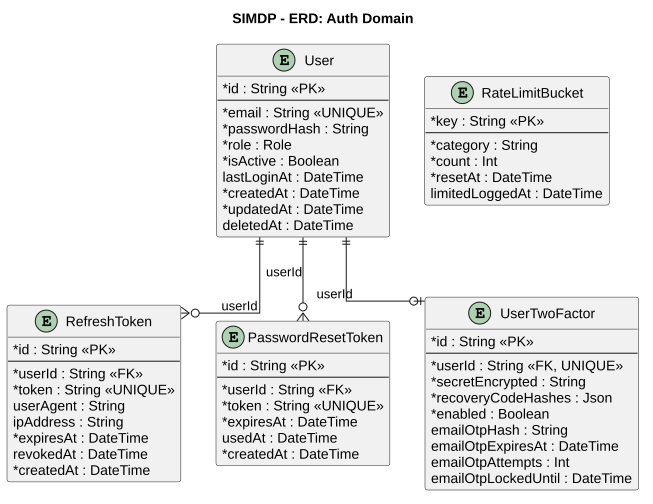
</p-->

* **Apa yang digambarkan?**: Struktur tabel `users`, `refresh_tokens`, `password_reset_tokens`, dan `rate_limit_buckets`.
* **Poin Penting yang Harus Diperhatikan**: Kolom `email` dan `nip` memiliki indeks unik (*unique index*) untuk mempercepat pencarian saat proses login.
* **Mengapa Diagram Ini Penting?**: Memastikan pencarian akun saat login berlangsung dalam hitungan milidetik.

#### 3. Tabel Database Pegawai & Master Data (`erd/erd-employee-master-data.svg`)

<p align="center"-->
  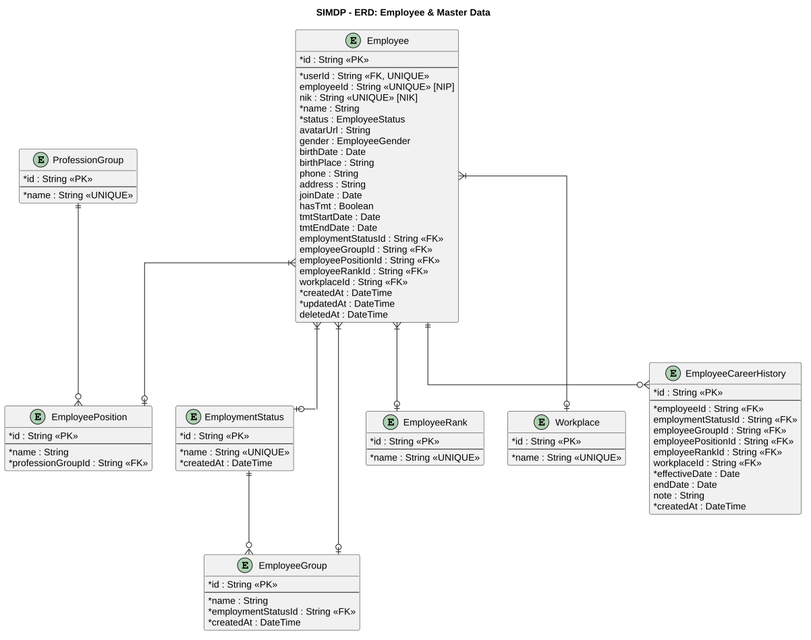
</p-->

* **Apa yang digambarkan?**: Struktur tabel `employees`, `employment_statuses`, `employee_groups`, `profession_groups`, `employee_positions`, `employee_ranks`, `workplaces`, dan `employee_career_histories`.
* **Poin Penting yang Harus Diperhatikan**: Penggunaan *UUID* sebagai kata kunci unik (*primary key*) untuk menjaga kerahasiaan urutan data.
* **Mengapa Diagram Ini Penting?**: Mampu menampung ribuan data pegawai RSUD Bahteramas beserta histori perubahannya tanpa penurunan kinerja.

#### 4. Tabel Database Dokumen & Verifikasi (`erd/erd-document-verification.svg`)

<p align="center"-->
  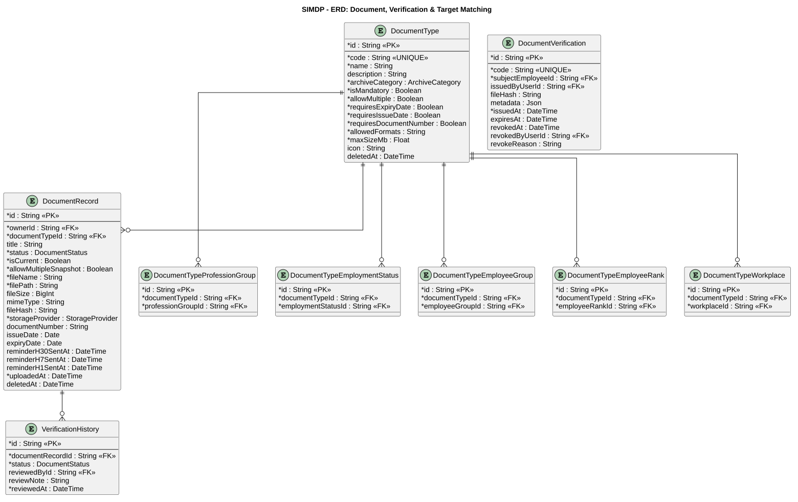
</p-->

* **Apa yang digambarkan?**: Struktur tabel `document_types`, `document_records`, `verification_histories`, dan `document_verifications`.
* **Poin Penting yang Harus Diperhatikan**: Tabel `document_records` menyimpan hash keaslian file (*fileHash*) untuk mendeteksi apakah file pernah diubah secara tidak sah.
* **Mengapa Diagram Ini Penting?**: Menjamin keabsahan dan integritas hukum arsip digital pegawai.

#### 5. Tabel Database Sistem & Audit Log (`erd/erd-system-support.svg`)

<p align="center"-->
  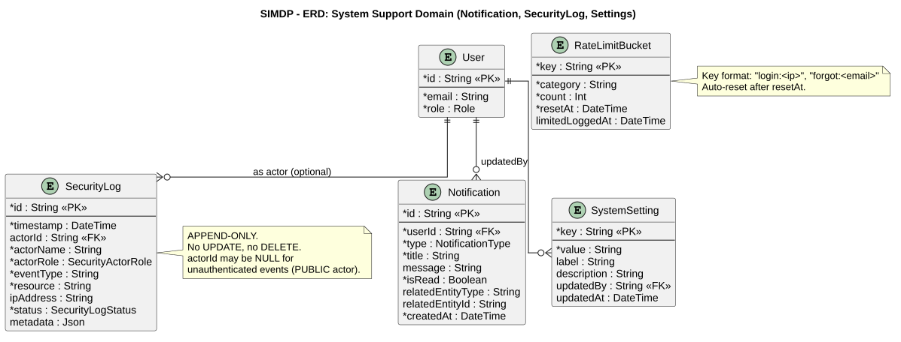
</p-->

* **Apa yang digambarkan?**: Struktur tabel `notifications`, `security_logs`, dan `system_settings`.
* **Poin Penting yang Harus Diperhatikan**: Tabel `security_logs` menggunakan kolom bertipe *JSONB* untuk fleksibilitas pencatatan detail kejadian keamanan.
* **Mengapa Diagram Ini Penting?**: Mendukung analisis forensik digital jika terjadi insiden keamanan siber.

---

## 5. Glosarium Istilah Penting

Berikut adalah kamus istilah sederhana untuk membantu memahami istilah-istilah di dalam dokumentasi ini:

| Istilah | Arti dan Penjelasan Sederhana |
|---|---|
|  **DocumentRecord** | Catatan arsip digital untuk satu berkas dokumen yang diunggah pegawai di dalam database. |
|  **DocumentType** | Master kualifikasi jenis dokumen (seperti KTP, Ijazah, SK CPNS, STR, SIP). |
| **Verifikasi** | Proses peninjauan keabsahan dokumen oleh Staf Kepegawaian sebelum dokumen diakui sah (*APPROVED*). |
|  **Role / Hak Akses** | Tingkat wewenang pengguna (Pegawai, Staf Kepegawaian, atau Administrator). |
|  **Notifikasi (In-App & Email)** | Pesan pemberitahuan yang muncul di layar aplikasi maupun dikirimkan ke kotak masuk email pegawai. |
|  **Cron Job / Otomasi** | Jadwal tugas otomatis yang dijalankan server setiap malam untuk mengecek dokumen kadaluarsa. |
| **File Storage** | Tempat penyimpanan aman untuk berkas fisik (PDF/JPG), terpisah dari database utama. |
|  **JWT / Refresh Token** | Kunci rahasia digital pengganti password agar pengguna tidak perlu terus-menerus mengetik password saat berpindah halaman. |
|  **Soft Delete** | Metode penghapusan data di mana data tidak benar-benar hilang dari database, melainkan hanya disembunyikan agar bisa dipulihkan jika diperlukan. |
| **Audit Trail / Log** | Catatan rekam jejak digital yang mencatat siapa melakukan apa, kapan, dan dari mana. |

---

## 6. Penutup

Dokumentasi ini adalah **Master Blueprint Visual SIMDP** yang mencakup seluruh 46 diagram arsitektur sistem. Dengan adanya panduan naratif ini, seluruh pihak — baik manajemen rumah sakit, tim kepegawaian, verifikator, maupun tim pengembang — memiliki pemahaman yang sama mengenai cara kerja, alur data, dan standar keamanan aplikasi SIMDP RSUD Bahteramas.

Dokumentasi ini akan terus dipelihara dan diperbarui secara berkala seiring dengan perkembangan fitur dan arsitektur aplikasi di masa mendatang.

---
*Dibuat untuk RSUD Bahteramas — Tim Arsitektur & Pengembang SIMDP*

