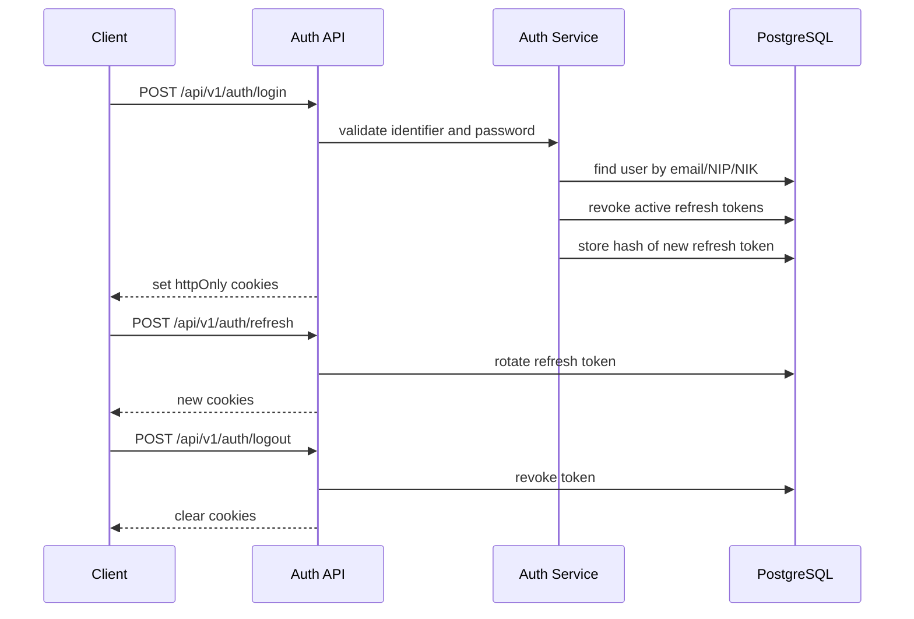
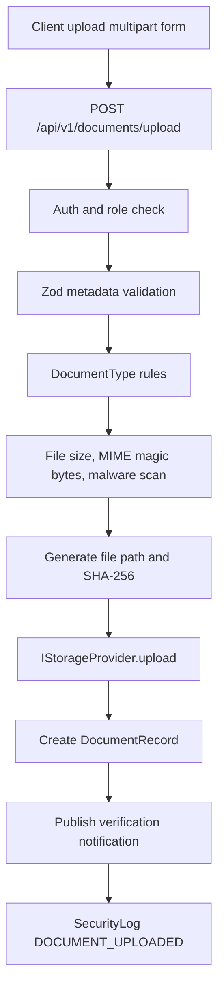
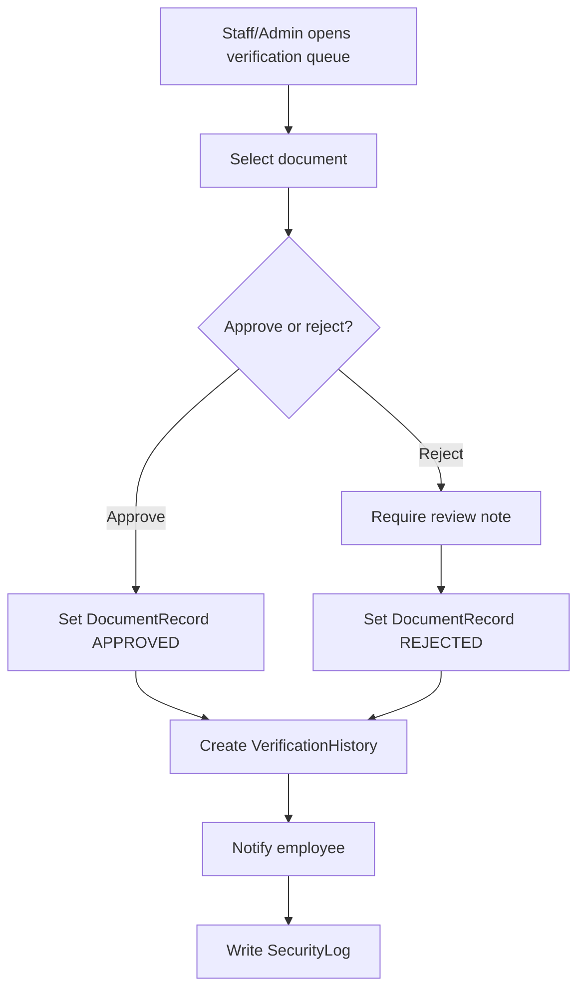
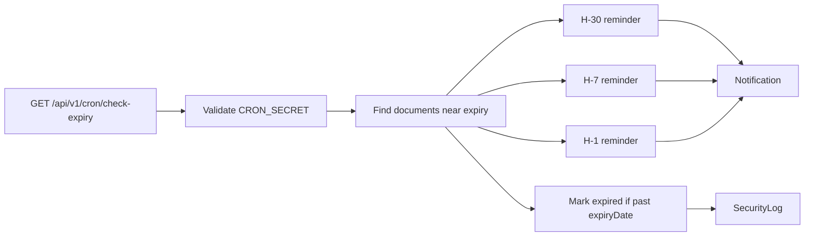
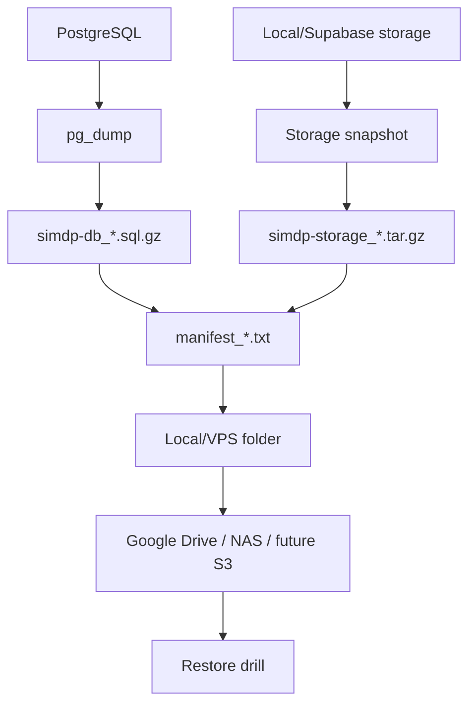

# Data Flow

Halaman ini merangkum alur utama aplikasi.

## Login, refresh, logout

```mermaid
sequenceDiagram
  participant Client
  participant AuthAPI as Auth API
  participant AuthService as Auth Service
  participant DB as PostgreSQL

  Client->>AuthAPI: POST /api/v1/auth/login
  AuthAPI->>AuthService: validate identifier and password
  AuthService->>DB: find user by email/NIP/NIK
  AuthService->>DB: revoke active refresh tokens
  AuthService->>DB: store hash of new refresh token
  AuthAPI-->>Client: set httpOnly cookies
  Client->>AuthAPI: POST /api/v1/auth/refresh
  AuthAPI->>DB: rotate refresh token
  AuthAPI-->>Client: new cookies
  Client->>AuthAPI: POST /api/v1/auth/logout
  AuthAPI->>DB: revoke token
  AuthAPI-->>Client: clear cookies
```

## Upload dokumen

```mermaid
flowchart TD
  A["Client upload multipart form"] --> B["POST /api/v1/documents/upload"]
  B --> C["Auth and role check"]
  C --> D["Zod metadata validation"]
  D --> E["DocumentType rules"]
  E --> F["File size, MIME magic bytes, malware scan"]
  F --> G["Generate file path and SHA-256"]
  G --> H["IStorageProvider.upload"]
  H --> I["Create DocumentRecord"]
  I --> J["Publish verification notification"]
  J --> K["SecurityLog DOCUMENT_UPLOADED"]
```

## Verifikasi dokumen

```mermaid
flowchart TD
  A["Staff/Admin opens verification queue"] --> B["Select document"]
  B --> C{"Approve or reject?"}
  C -->|Approve| D["Set DocumentRecord APPROVED"]
  C -->|Reject| E["Require review note"]
  E --> F["Set DocumentRecord REJECTED"]
  D --> G["Create VerificationHistory"]
  F --> G
  G --> H["Notify employee"]
  H --> I["Write SecurityLog"]
```

## Reminder kedaluwarsa

```mermaid
flowchart LR
  Cron["GET /api/v1/cron/check-expiry"] --> Secret["Validate CRON_SECRET"]
  Secret --> Query["Find documents near expiry"]
  Query --> H30["H-30 reminder"]
  Query --> H7["H-7 reminder"]
  Query --> H1["H-1 reminder"]
  Query --> Expired["Mark expired if past expiryDate"]
  H30 --> Notify["Notification"]
  H7 --> Notify
  H1 --> Notify
  Expired --> Audit["SecurityLog"]
```

## Backup dan restore

```mermaid
flowchart TD
  DB["PostgreSQL"] --> Dump["pg_dump"]
  Storage["Local/Supabase storage"] --> Snapshot["Storage snapshot"]
  Dump --> Artifact["simdp-db_*.sql.gz"]
  Snapshot --> Archive["simdp-storage_*.tar.gz"]
  Artifact --> Manifest["manifest_*.txt"]
  Archive --> Manifest
  Manifest --> Local["Local/VPS folder"]
  Local --> Offsite["Google Drive / NAS / future S3"]
  Offsite --> Restore["Restore drill"]
```
