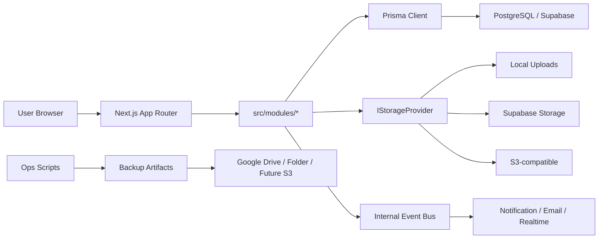
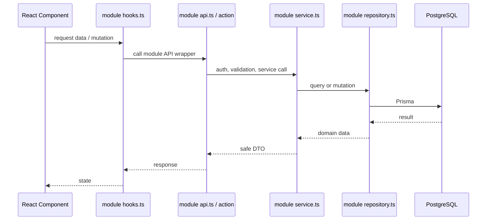

# Architecture Overview

SIMDP memakai arsitektur modular di atas Next.js App Router. Prinsip utamanya sederhana: UI dan route tidak boleh langsung mengakses database atau storage. Semua perubahan data harus melewati service boundary modul.

## Gambaran sistem

## Prinsip desain

1. Modul adalah bounded context.
2. `service.ts` adalah public boundary modul.
3. Repository hanya boleh dipanggil oleh service modul yang sama.
4. Client component tidak boleh melakukan `fetch()` langsung.
5. Semua input eksternal divalidasi dengan Zod.
6. Aksi sensitif wajib menulis `SecurityLog`.
7. Storage dokumen aplikasi dan target backup adalah concern berbeda.
8. `statistics` adalah modul read-only.

## Request flow standar

## Runtime deployment

SIMDP mendukung beberapa pola deployment:

| Deployment | Database | Storage dokumen | Backup target |
|---|---|---|---|
| Vercel + Supabase | Supabase PostgreSQL | Supabase Storage | Google Drive/offsite job |
| VPS local | PostgreSQL lokal/Docker | Folder local `/uploads` | Folder/NAS lalu offsite |
| Hybrid | Supabase PostgreSQL | Supabase Storage atau local | Local worker/offsite |

`DEPLOYMENT_CONTEXT` dipakai untuk guard konfigurasi agar kombinasi env yang berbahaya gagal cepat.

## Source detail

- `context/architecture/system-overview.md`
- `context/architecture/module-boundaries.md`
- `context/architecture/patterns.md`
- `context/architecture/diagrams/`
