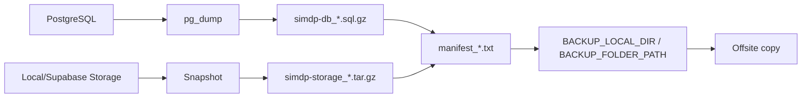

# Backup and Recovery

SIMDP menyimpan data pegawai dan dokumen legal. Backup tidak boleh hanya berupa export CSV dari admin UI. Disaster recovery harus mencakup database dan storage dokumen sebagai satu paket.

## Target awal

| Istilah | Target SIMDP |
|---|---|
| RPO | Maksimal kehilangan data 24 jam. |
| RTO | Maksimal downtime 4 jam. |
| Daily retention | 14 hari. |
| Weekly retention | 8 minggu. |
| Monthly retention | 12 bulan. |

## Apa yang wajib dibackup

1. Database PostgreSQL:
   - user, role, session token hash;
   - pegawai dan master data;
   - metadata dokumen;
   - verification history;
   - notification;
   - security log;
   - system settings.

2. Storage dokumen:
   - file PDF/dokumen pegawai;
   - foto profil upload manual;
   - path harus tetap cocok dengan `DocumentRecord.filePath`.

3. Konfigurasi:
   - nama variable boleh didokumentasikan;
   - nilai secret tidak boleh disimpan di docs/repo.

## Prioritas target backup

1. Google Drive service account sebagai offsite utama.
2. VPS/local folder sebagai jalur kedua, lalu disalin offsite.
3. S3/S3-compatible sebagai opsi terakhir/future.

## Alur backup lokal/VPS

## Prinsip restore

- Jangan restore langsung ke production jika bisa memakai database sementara.
- Pilih database artifact dan storage artifact dengan timestamp yang cocok.
- Validasi hasil restore sebelum cutover.
- Catat hasil restore drill.
- Jika incident production, komunikasikan downtime dan freeze upload/edit sementara.

## Runbook detail

Source detail:

- `context/operations/backup-disaster-recovery.md`
- `context/operations/local-vps-backup-automation.md`
- `context/operations/restore-drill-template.md`
