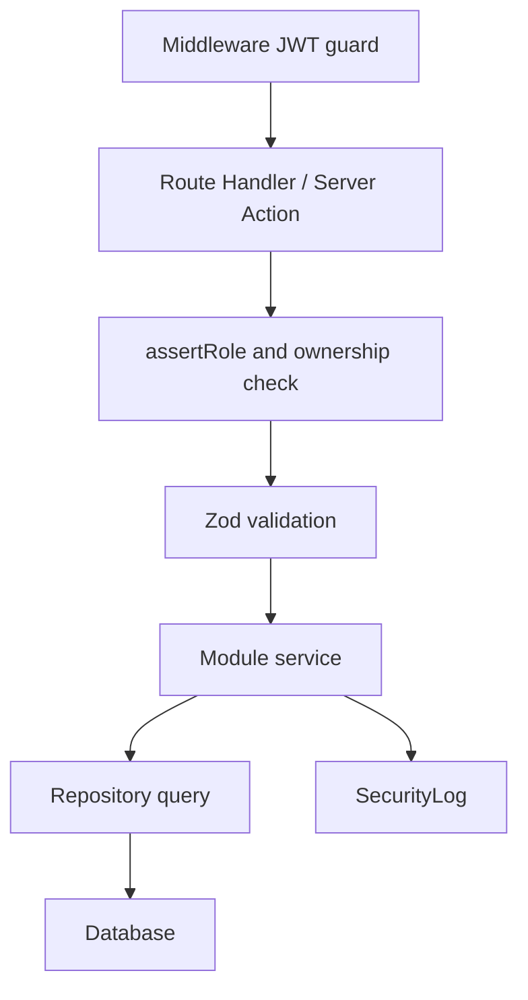

# Auth and RBAC

SIMDP memakai custom JWT dan refresh token, bukan NextAuth atau Supabase Auth.

## Prinsip auth

- Access token disimpan di httpOnly cookie.
- Refresh token disimpan di httpOnly cookie.
- Refresh token yang masuk database adalah hash, bukan plaintext.
- Login baru revoke refresh token aktif sebelumnya.
- Semua event auth penting masuk `SecurityLog`.

## Identifier login

User dapat login memakai satu field:

- email;
- NIP;
- NIK.

Deteksi server:

1. Numerik 16 digit dianggap NIK.
2. Numerik minimal 10 digit dianggap NIP.
3. Selain itu dianggap email.

## Role

| Role | Level | Deskripsi |
|---|---:|---|
| `EMPLOYEE` | 1 | Pegawai, hanya data/dokumen sendiri. |
| `STAFF` | 2 | Petugas verifikasi dan baca data pegawai. |
| `ADMIN` | 3 | Admin sistem. |

## Security layers

## Permission ringkas

| Kemampuan | Employee | Staff | Admin |
|---|:---:|:---:|:---:|
| Upload dokumen sendiri | Yes | Yes | Yes |
| Lihat dokumen sendiri | Yes | Yes | Yes |
| Lihat semua dokumen pegawai | No | Yes | Yes |
| Approve/reject dokumen | No | Yes | Yes |
| CRUD pegawai | No | No | Yes |
| CRUD master data | No | No | Yes |
| Ubah system setting | No | No | Yes |
| Lihat security log | No | No | Yes |

## Default aman

Jika permission belum jelas:

1. default deny;
2. default Admin only jika fitur administratif;
3. catat keputusan di `context/memory/decisions-log.md`;
4. update RBAC docs.
